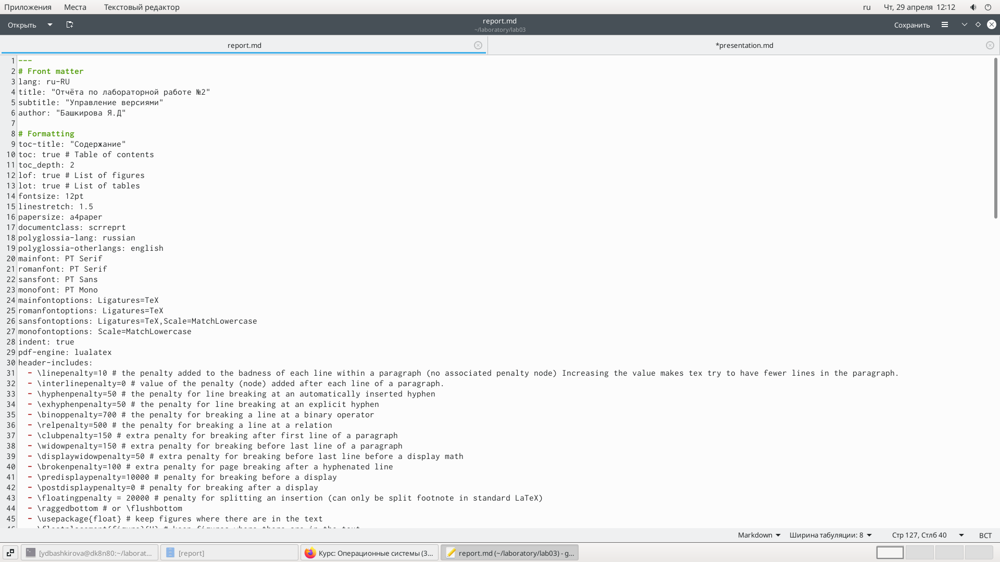
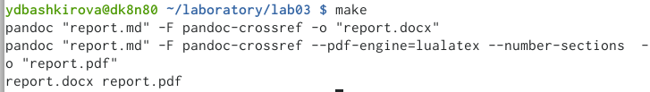
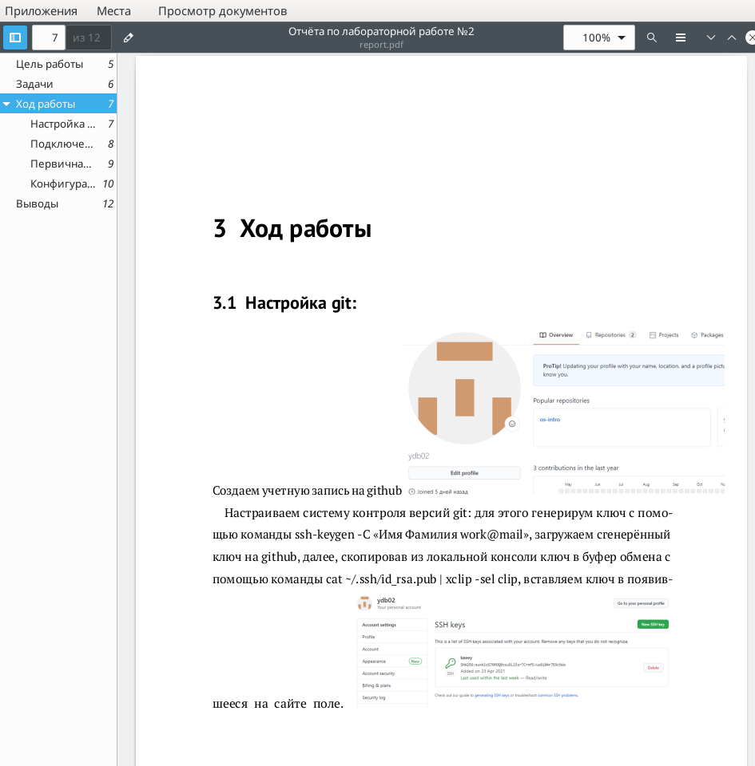
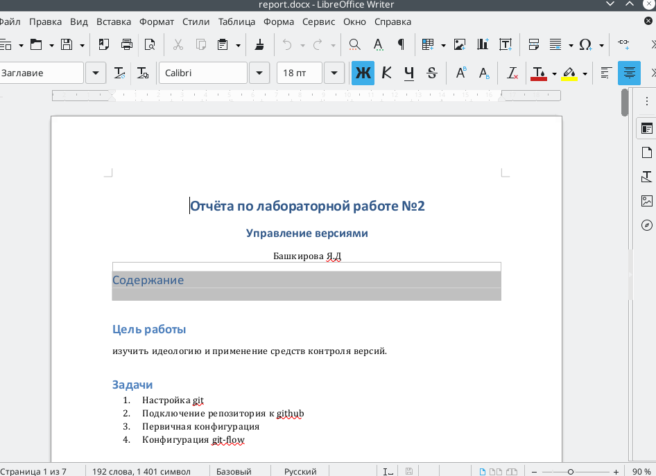
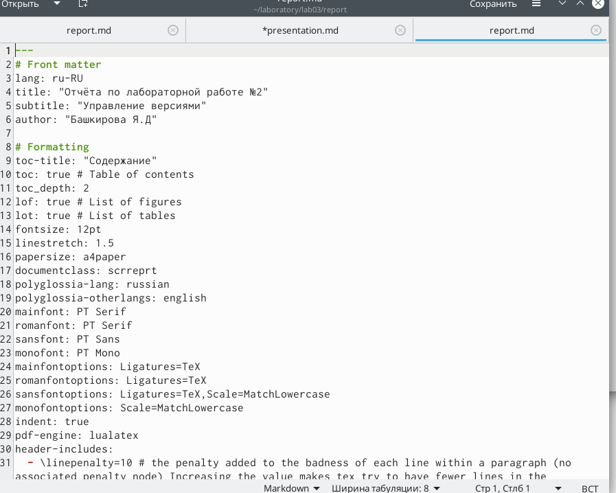

---
## Front matter
lang: ru-RU
title: Markdown
author: |
	Башкирова Я.Д.
date: 29.04.2021

## Formatting
toc: false
slide_level: 2
theme: metropolis
header-includes: 
 - \metroset{progressbar=frametitle,sectionpage=progressbar,numbering=fraction}
 - '\makeatletter'
 - '\beamer@ignorenonframefalse'
 - '\makeatother'
aspectratio: 43
section-titles: true
---

# Отчет по лабораторной работе №3

## Цели 
Научится оформлять отчеты с помощью легковесного языка разметки Markdown

## Создание markdown файла по шаблону
Я сделала отчет по предыдущей лабораторной работе в формате Markdown

{ #fig:001 width=70% }

## Работа с консолью
С помощью команды make я отформатировала наш файл в форматах docx и pdf

{ #fig:001 width=70% }

## Создание отчета в 3 форматах (pdf)

{ #fig:001 width=70% }

## Создание markdown файла по шаблону(docx)

{ #fig:001 width=70% }

## Создание markdown файла по шаблону(md)

{ #fig:001 width=70% }

## Вывод 
Я научилась оформлять отчеты с помощью легковесного языка разметки Markdown

