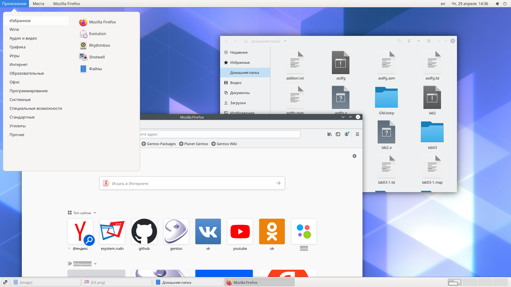
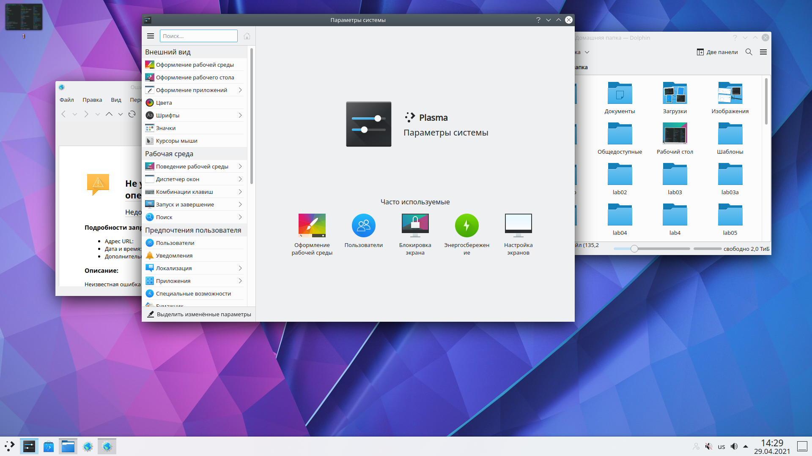
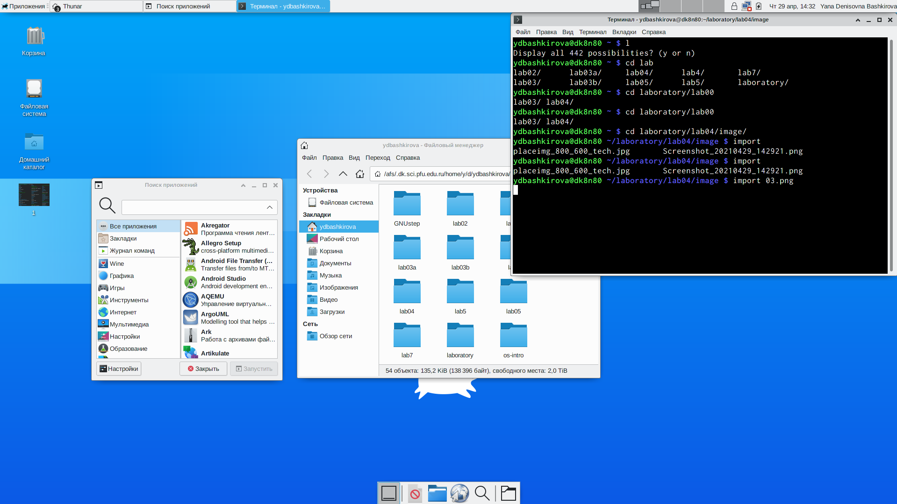
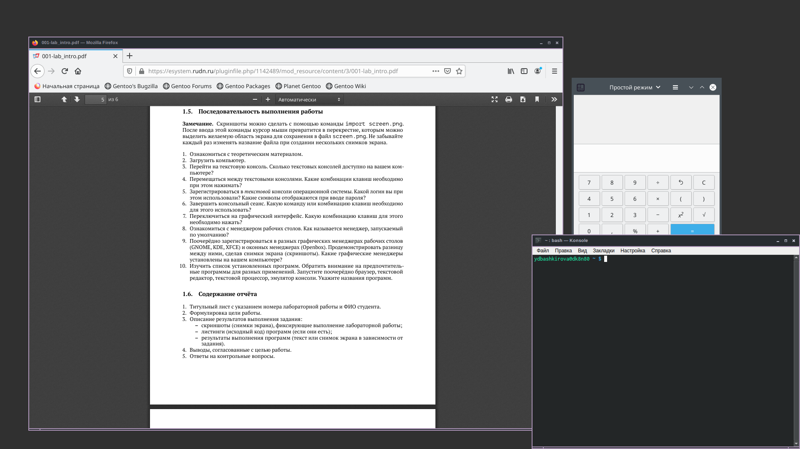

---
## Front matter
lang: ru-RU
title: Знакомство с операционной системой Linux
author: |
	Башкирова Я.Д
date: 29.04.2021

## Formatting
toc: false
slide_level: 2
theme: metropolis
header-includes: 
 - \metroset{progressbar=frametitle,sectionpage=progressbar,numbering=fraction}
 - '\makeatletter'
 - '\beamer@ignorenonframefalse'
 - '\makeatother'
aspectratio: 43
section-titles: true
---

# Отчет по лабораторной работе №4

## Цель работы

Познакомиться с операционной системой Linux,получить практические навыки рабо-ты с консолью и некоторыми графическими менеджерами рабочих столов операционнойсистемы.

## Ход работа

1. Я ознакомилась с теоретическим материалом.
2. Загрузить компьютер.
3. Я перешла на тексовую консоль.На моем компьютере 6 тексовых консолей.
4. Я перемещаюсь между тексовыми консолями с помощью сочетания клавиши Ctrl+Alt с одной из функциональных клавиш F1-F6.
5. Я зарегистрировалась в текстовой консоли операционной системы. Я использовала логин ydbashkirova. При вводе пароля никакие символы не отображаются.
6. Я завершила консольный сеанс. Для перехода из текстового режима в графический необходимо нажать Ctrl+Alt+F7
7. Для переключения из графического режима в одну из текстовых виртуальных консолей достаточно нажать комбинацию клавиш Ctrl+Alt+FNN
8. Я ознакомилась с менеджером рабочих столов. Менеджер рабочих столов GNOME

## Графические менеджеры рабочих столов

Поочерёдно зарегистрировалась в разных графических менеджерах рабочих столов(GNOME,KDE,XFCE) и оконных менеджерах (Openbox).Продемонстрировала разницу между ними, сделав снимки экрана (скриншоты). 

GNOME
{ #fig:001 width=70% }

## Графические менеджеры рабочих столов

Plasma (KDE)
{ #fig:001 width=70% }

## Графические менеджеры рабочих столов 

XFCE
{ #fig:001 width=70% }

## Графические менеджеры рабочих столов 

Openbox
{ #fig:001 width=70% }

На моем компьютере установлены следующие графические менеджеры: GNOME, XSession, awesome и т.д

## Cписок установленных программ

Изучила список установленных программ. Обратила внимание на предпочтительные программы для разных применений.Запустила поочерёдно браузер,текстовой редактор,текстовой процессор,эмулятор консоли.Браузер(Mozilla Firefox),текстовый редактор(Geany), текстовой процессор(Word),эмулятор консоли(Терминал)

## Вывод
Я познакомилась с  операционной системой Linux,получила практические навыки работы с консолью и некоторыми графическими менеджерами рабочих столов операционнойсистемы.

