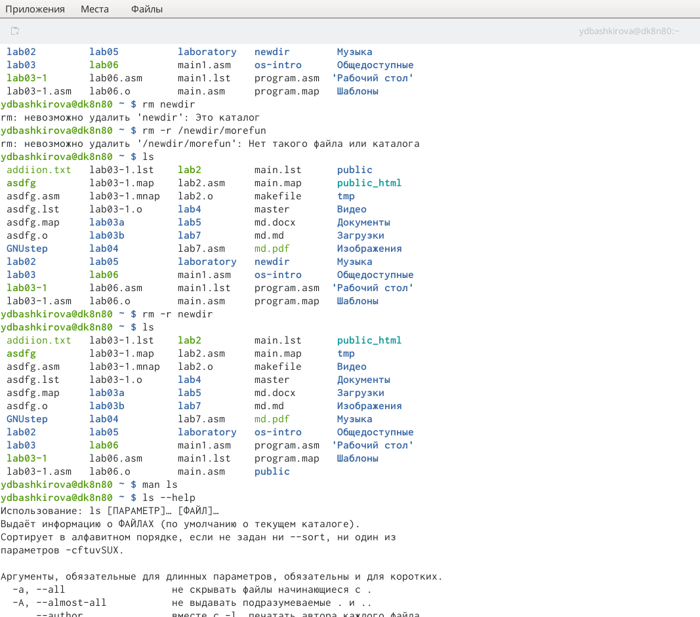

---
## Front matter
lang: ru-RU
title: Основы интерфейсавзаимодействия пользователя с системой Unix на уровнекомандной строки
author: Башкирова Я.Д
date: 13.05.2021

## Formatting
toc: false
slide_level: 2
theme: metropolis
header-includes: 
 - \metroset{progressbar=frametitle,sectionpage=progressbar,numbering=fraction}
 - '\makeatletter'
 - '\beamer@ignorenonframefalse'
 - '\makeatother'
aspectratio: 43
section-titles: true
---

# Отчет по лабораторной работе №5

## Цель работы

Приобретение практических навыков взаимодействия пользователя с системойпосредством командной строки.

# Ход работы 

## Домашний каталог
{ #fig:001 width=70% }

## Создание нового каталога с именем newdir 
{ #fig:001 width=70% }

## Команда man

{ #fig:001 width=70% }

## Использование команды man для просмотра описания команд: cd, pwd, mkdir, rmdir, rm.

{ #fig:001 width=70% }

{ #fig:001 width=70% }

## Команда  history

{ #fig:001 width=70% }

{ #fig:001 width=70% }

## Выводы

Во время выполнения лабораторной работы я приобрела практические навыки взаимодействия пользователя с системой посредством командной строки.
