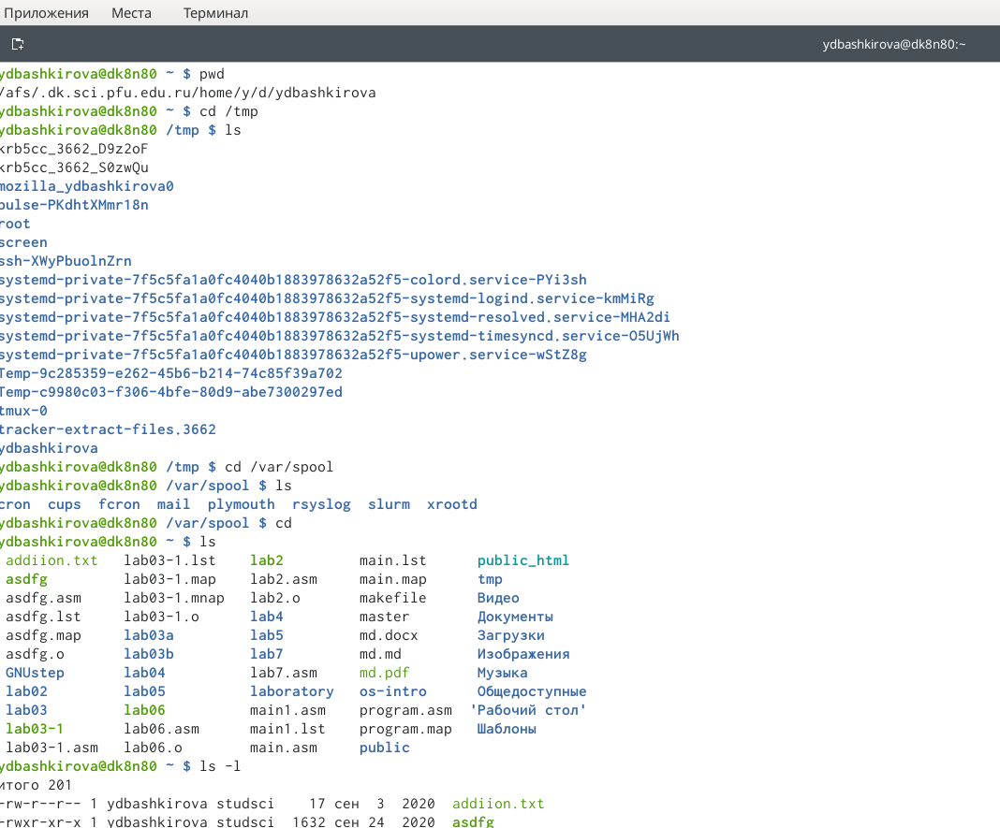
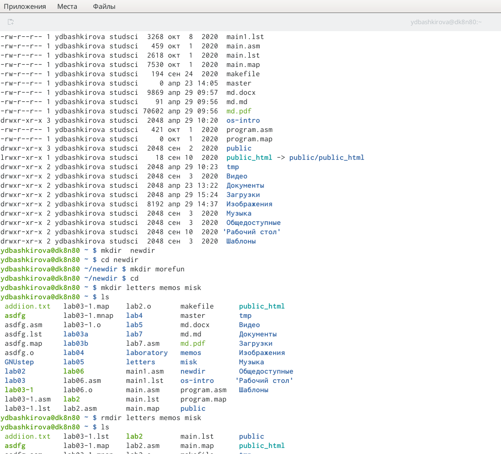
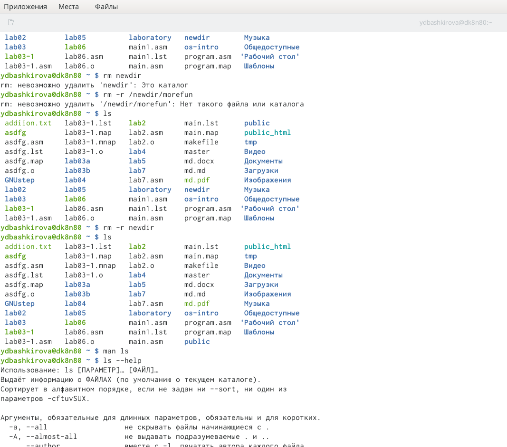
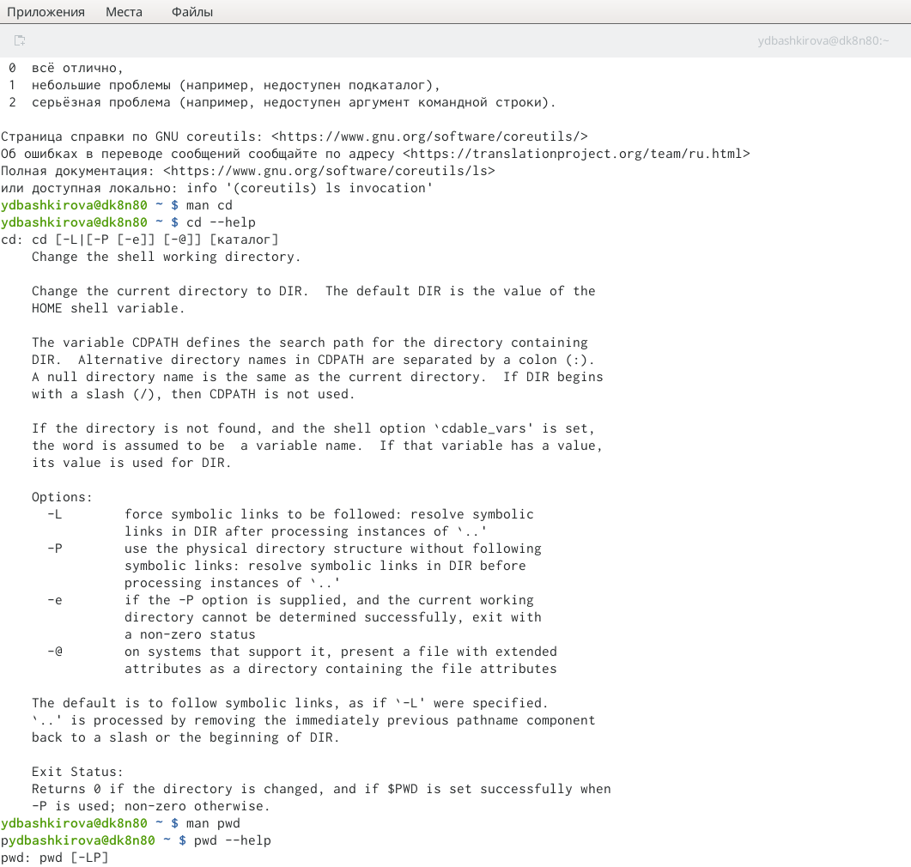
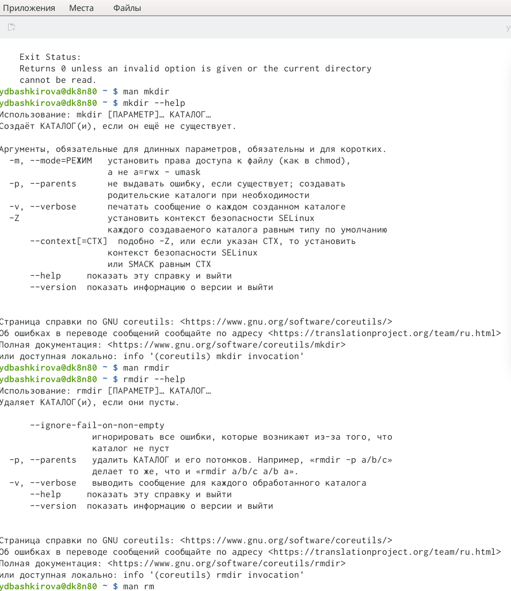
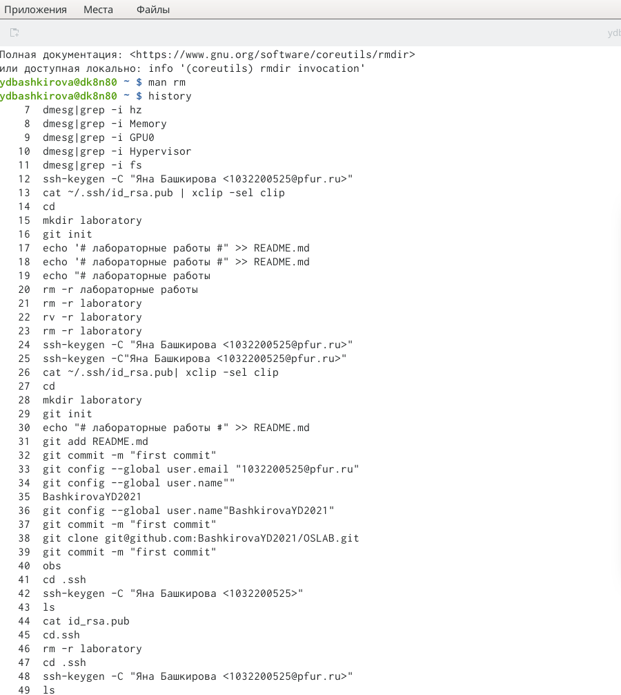
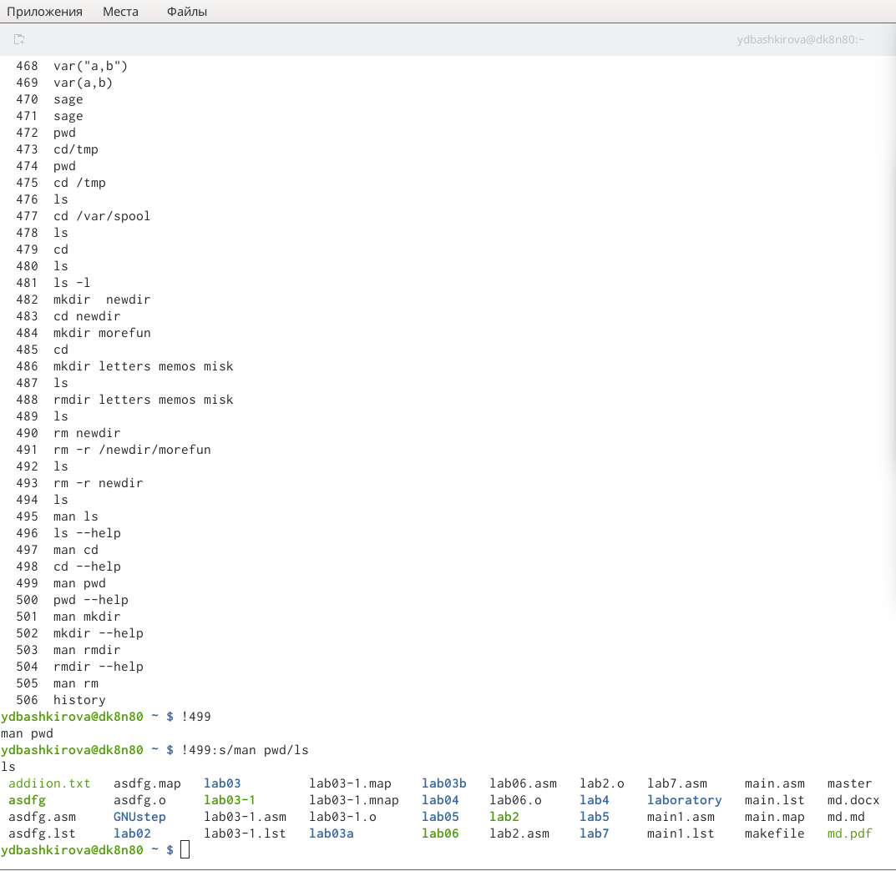

---
# Front matter
lang: ru-RU
title: "Oтчёта по лабораторной работе 5"
subtitle: "Основы интерфейсавзаимодействия пользователя с системой Unix на уровнекомандной строки"
author: "Башкирова Я.Д"

# Formatting
toc-title: "Содержание"
toc: true # Table of contents
toc_depth: 2
lof: true # List of figures
lot: true # List of tables
fontsize: 12pt
linestretch: 1.5
papersize: a4paper
documentclass: scrreprt
polyglossia-lang: russian
polyglossia-otherlangs: english
mainfont: PT Serif
romanfont: PT Serif
sansfont: PT Sans
monofont: PT Mono
mainfontoptions: Ligatures=TeX
romanfontoptions: Ligatures=TeX
sansfontoptions: Ligatures=TeX,Scale=MatchLowercase
monofontoptions: Scale=MatchLowercase
indent: true
pdf-engine: lualatex
header-includes:
  - \linepenalty=10 # the penalty added to the badness of each line within a paragraph (no associated penalty node) Increasing the value makes tex try to have fewer lines in the paragraph.
  - \interlinepenalty=0 # value of the penalty (node) added after each line of a paragraph.
  - \hyphenpenalty=50 # the penalty for line breaking at an automatically inserted hyphen
  - \exhyphenpenalty=50 # the penalty for line breaking at an explicit hyphen
  - \binoppenalty=700 # the penalty for breaking a line at a binary operator
  - \relpenalty=500 # the penalty for breaking a line at a relation
  - \clubpenalty=150 # extra penalty for breaking after first line of a paragraph
  - \widowpenalty=150 # extra penalty for breaking before last line of a paragraph
  - \displaywidowpenalty=50 # extra penalty for breaking before last line before a display math
  - \brokenpenalty=100 # extra penalty for page breaking after a hyphenated line
  - \predisplaypenalty=10000 # penalty for breaking before a display
  - \postdisplaypenalty=0 # penalty for breaking after a display
  - \floatingpenalty = 20000 # penalty for splitting an insertion (can only be split footnote in standard LaTeX)
  - \raggedbottom # or \flushbottom
  - \usepackage{float} # keep figures where there are in the text
  - \floatplacement{figure}{H} # keep figures where there are in the text
---

# Цель работы

Приобретение практических навыков взаимодействия пользователя с системойпосредством командной строки.

# Задание

1. Определите полное имя вашего домашнего каталога. Далее относительно этогокаталога будут выполняться последующие упражнения.
2. Выполните следующие действия:
2.1.Перейдите в каталог/tmp.
2.2.Выведите на экран содержимое каталога/tmp. Для этого используйте ко-мандуlsс различными опциями. Поясните разницу в выводимой на экранинформации.
2.3.Определите, есть ли в каталоге/var/spoolподкаталог с именемcron?
2.4.Перейдите в Ваш домашний каталог и выведите на экран его содержимое.
3. Выполните следующие действия:
3.1.В домашнем каталоге создайте новый каталог с именемnewdir.
3.2.В каталоге~/newdirсоздайте новый каталог с именемmorefun.
3.3.В домашнем каталоге создайте одной командой три новых каталога с име-намиletters,memos,misk. Затем удалите эти каталоги одной командой.
3.4.Попробуйте удалить ранее созданный каталог~/newdirкомандойrm. Про-верьте, был ли каталог удалён.
3.5.Удалите каталог~/newdir/morefunиз домашнего каталога. Проверьте,был ли каталог удалён.
4. С помощью командыmanопределите, какую опцию командыlsнужно исполь-зовать для просмотра содержимое не только указанного каталога, но и подката-логов, входящих в него.
5. С помощью командыmanопределите набор опций командыls, позволяющий от-сортировать по времени последнего изменения выводимый список содержимогокаталога с развёрнутым описанием файлов.
6. Используйте командуmanдля просмотра описания следующих команд:cd,pwd,mkdir,rmdir,rm. Поясните основные опции этих команд.
7. Используя информацию, полученную при помощи командыhistory, выполнитемодификацию и исполнение нескольких команд из буфера команд.

# Ход работы

1. Я определила полное имя своего домашнего каталога. И относительно данного каталога я выполняла все последующие упражнения.
2. Выполнила такие действия: 2.1. Перешла в каталог /tmp. 2.2. Вывела на экран содержимое каталога /tmp, используя команду ls. 2.3. Определила, есть ли в каталоге /var/spool подкаталог с именем cron. Да, такой подкатолог с именем cron существует. 2.4. Затем перешла в свой домашний каталог и вывела на экран его содержимое. После определила, кто является владельцем файлов и подкаталогов.

{ #fig:001 width=70% }

3. Выполнила такие действия, как: 3.1. В домашнем каталоге создала новый католог с именем newdir. 3.2. В этом каталоге я создала новый каталог с именем morefun.
3.3. В домашнем каталоге создала одной командой три новых каталога с именем letters, memos, misk.

{ #fig:001 width=70% }

3.3. В домашнем каталоге создала одной командой три новых каталога с именем letters, memos, misk.А после удалила эти каталоги одной командой.
3.4. Попробовала удалить ранее созданный каталог /newdir командой rm. Этот каталог не удалился, так как он не являлся пустым.
3.5. Удалила каталог /newdir/morefun из домашнего каталога (вернее удалила каталог newdir, который включал в себя кталог morefun) через команду rm -r newdir.

4. С помощью команды man определила, какую опцию команды ls нужно использовать для просмотра содержимого не только указанного каталога, но и подкаталогов, входящих в него.

{ #fig:001 width=70% }

5. С помощью команды man определила набор опций команды ls, позволяющий отсортировать повремени последнего изменения выводимый список содержимого каталога с развёрнутым описанием файлов.
6. Используйте командуmanдля просмотра описания следующих команд: cd, pwd, mkdir, rmdir, rm.

{ #fig:001 width=70% }

{ #fig:001 width=70% }

7. Используя информацию, полученную при помощи команды history, выполнила модификацию и исполнение нескольких команд из буфера команд.

{ #fig:001 width=70% }

{ #fig:001 width=70% }

# Выводы

Во время выполнения лабораторной работы я приобрела практические навыки взаимодействия пользователя с системой посредством командной строки.

# Контрольные вопросы

1. Командная строка (консоль или Терминал) –это специальная программа, которая позволяет управлять компьютером путем ввода текстовых команд с клавиатуры.
2. Для определения абсолютного пути к текущему каталогу используется команда pwd(print working directory) Пример (абсолютное имя текущего каталога пользователя dharma): pwd результат:/afs/dk.sci.pfu.edu.ru/home/d/h/dharma
3. Основные опции: -name -поиск по имени, задается шаблон поиска; -user -поиск файлов принадлежащих конкретному пользователю; -group -поиск файлов принадлежащих конкретной группе; -perm -поиск файлов по режиму доступа; -type -поиск файлов по типу.
4. Некоторые файлы в операционной системе скрыты от просмотра и обычно используются для настройки рабочей среды. Имена таких файлов начинаются с точки. Для того, чтобы отобразить имена скрытых файлов, необходимо использовать команду ls с опцией a:ls -a
5. Команда rm используется для удаления файлов и/или каталогов.Чтобы удалить каталог, содержащий файлы, нужно использовать опцию r. Без указания этой опции команда не будет выполняться.Если каталог пуст, то можно воспользоваться командой rmdir. Если удаляемый каталог содержит файлы, то команда не будет выполнена —нужно использовать rm –r.
6. Для вывода на экран списка ранее выполненных команд используется команда history.
7. Выводимые на экран команды в списке нумеруются. К любой команде из выведенного на экран списка можно обратиться по её номеру в списке, воспользовавшись конструкцией!.
Пример:
history
1 pwd
2 ls
3 ls -a 
4 ls -l
5 cd /
6 history !
5 cd /
Можно модифицировать команду из выведенного на экран списка при помощи следующей конструкции:
!:s//
8. Использование символа «;».Если требуется выполнить последовательно несколько команд, записанный в одной строке, то для этого используется символ точка с запятой
Пример: cd; ls 
9. Если в заданном контексте встречаются специальные символы (типа «.», «/», «*» и т.д.), надо перед ними поставить символ экранирования (обратный слэш).
!3:s/ cd//F ls –FКогда мы использовали команду cd/ то перед / поставили.
10. Какая информация выводится на экран о файлах и каталогах, если используется опция l в команде ls?Чтобы вывести на экран подробную информацию о файлах и каталогах, необходимо использовать опцию l. При этом о каждом файле и каталоге будет выведена следующая информация:
–тип файла,
-право доступа,
–число ссылок,
–владелец,
–размер,
–дата последней ревизии,
–имя файла или каталога.
11. Относительный путь —так же как и полный путь, строится перечислением через / всех каталогов, но начинается от текущего каталога (каталога, в котором «находится» пользователь), т.е. пользователь, находясь в каталоге user, может обратиться к файлу addition.txt, указав относительный путь documents/addition.txt.Таким образом, в Linux если имя объекта начинается с /, то системой это интерпретируется как полный
12. Команда man используется для просмотра (оперативная помощь) в диалоговом режиме руководства (manual) по основным командам операционной системы типа Linux. Формат команды: man
13. Автодополнение с помощью клавиши TabTab: автоматически завершает ввод имени файла, имени каталога или команды.
