---
## Front matter
lang: ru-RU
title: Анализ файловой системы Linux.Команды для работы с файлами и каталогами
author: Башкирова Я.Д
date: 13.05.2021

## Formatting
toc: false
slide_level: 2
theme: metropolis
header-includes: 
 - \metroset{progressbar=frametitle,sectionpage=progressbar,numbering=fraction}
 - '\makeatletter'
 - '\beamer@ignorenonframefalse'
 - '\makeatother'
aspectratio: 43
section-titles: true
---

# Отчет по лабораторной работе №6 

# Команды для работы с файлами и каталогами

## Копирование файлов и каталогов

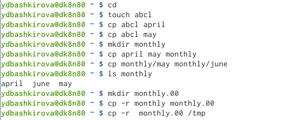{ #fig:001 width=70% }

## Перемещение и переименование файлов и каталогов

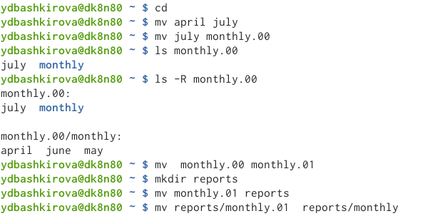{ #fig:001 width=70% }

## Изменение прав доступа

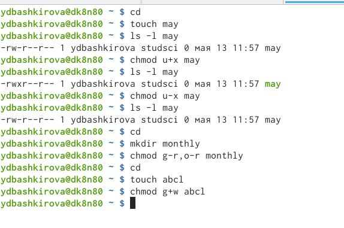{ #fig:001 width=70% }

## Использование команд и результаты их действия

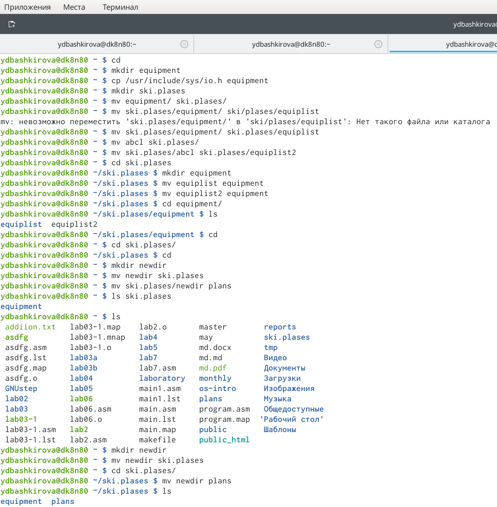{ #fig:001 width=70% }

## Опции команды chmod

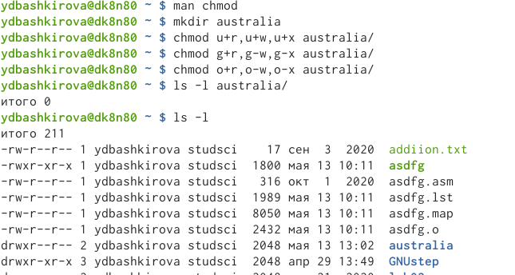{ #fig:001 width=70% }

## Опции команды chmod

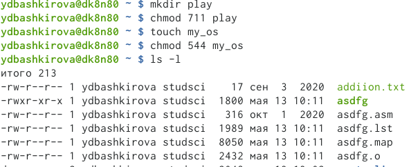{ #fig:001 width=70% }

## Опции команды chmod

{ #fig:001 width=70% }

## Работа с файлами и каталогами

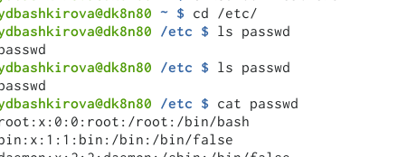{ #fig:001 width=70% }

## Работа с файлами и каталогами

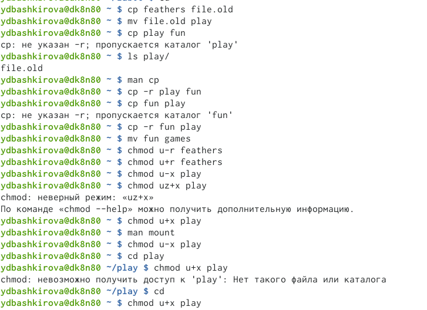{ #fig:001 width=70% }

## Команда man

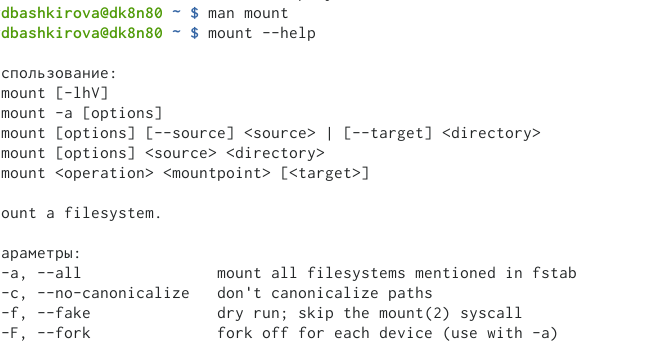{ #fig:001 width=70% }

## Команда man

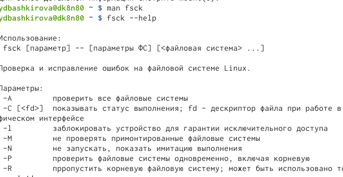{ #fig:001 width=70% }

## Команда man

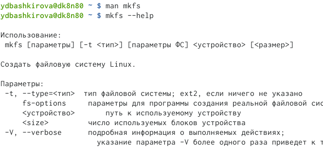{ #fig:001 width=70% }

## Команда man

{ #fig:001 width=70% }

## Вывод

Я ознакомилась с файловой системой Linux, её структурой, именами и содержанием каталогов. Приобрела практических навыков по применению команд для работы с файлами и каталогами, по управлению процессами (и работами), по проверке использования диска и обслуживанию файловой системы

