---
# Front matter
lang: ru-RU
title: "Анализ файловой системы Linux.Команды для работы с файлами и каталогами"
author: "Башкирова Я.Д"

# Formatting
toc-title: "Отчет по лабораторной работе №6"
toc: true # Table of contents
toc_depth: 2
lof: true # List of figures
lot: true # List of tables
fontsize: 12pt
linestretch: 1.5
papersize: a4paper
documentclass: scrreprt
polyglossia-lang: russian
polyglossia-otherlangs: english
mainfont: PT Serif
romanfont: PT Serif
sansfont: PT Sans
monofont: PT Mono
mainfontoptions: Ligatures=TeX
romanfontoptions: Ligatures=TeX
sansfontoptions: Ligatures=TeX,Scale=MatchLowercase
monofontoptions: Scale=MatchLowercase
indent: true
pdf-engine: lualatex
header-includes:
  - \linepenalty=10 # the penalty added to the badness of each line within a paragraph (no associated penalty node) Increasing the value makes tex try to have fewer lines in the paragraph.
  - \interlinepenalty=0 # value of the penalty (node) added after each line of a paragraph.
  - \hyphenpenalty=50 # the penalty for line breaking at an automatically inserted hyphen
  - \exhyphenpenalty=50 # the penalty for line breaking at an explicit hyphen
  - \binoppenalty=700 # the penalty for breaking a line at a binary operator
  - \relpenalty=500 # the penalty for breaking a line at a relation
  - \clubpenalty=150 # extra penalty for breaking after first line of a paragraph
  - \widowpenalty=150 # extra penalty for breaking before last line of a paragraph
  - \displaywidowpenalty=50 # extra penalty for breaking before last line before a display math
  - \brokenpenalty=100 # extra penalty for page breaking after a hyphenated line
  - \predisplaypenalty=10000 # penalty for breaking before a display
  - \postdisplaypenalty=0 # penalty for breaking after a display
  - \floatingpenalty = 20000 # penalty for splitting an insertion (can only be split footnote in standard LaTeX)
  - \raggedbottom # or \flushbottom
  - \usepackage{float} # keep figures where there are in the text
  - \floatplacement{figure}{H} # keep figures where there are in the text
---

# Цель работы

Ознакомление с файловой системой Linux, её структурой, именами и содержа-нием каталогов. Приобретение практических навыков по применению команд дляработы с файлами и каталогами, по управлению процессами (и работами), по про-верке использования диска и обслуживанию файловой системы

# Задание

1. Выполните все примеры, приведённые в первой части описания лабораторнойработы.
2. Выполните следующие действия, зафиксировав в отчёте по лабораторной работеиспользуемые при этом команды и результаты их выполнения:
2.1.Скопируйте файл/usr/include/sys/io.h в домашний каталог и назовите его equipment. Если файла io.h нет, то используйте любой другой файл вкаталоге/usr/include/sys/вместо него.2.2.В домашнем каталоге создайте директорию ~/ski.plases.
2.3.Переместите файлe quipment в каталог ~/ski.plases.
2.4.Переименуйте файл ~/ski.plases/equipmentв~/ski.plases/equiplist.
2.5.Создайте в домашнем каталоге файл abc1 и скопируйте его в каталог ~/ski.plases, назовите его equiplist2.
2.6.Создайте каталог с именемequipmentв каталоге~/ski.plases.
2.7.Переместите файлы~/ski.plases/equiplist и equiplist2 в каталог~/ski.plases/equipment.
2.8.Создайте и переместите каталог ~/newdir в каталог~/ski.plasesи назовите его plans.
3. Определите опции команды chmod, необходимые для того, чтобы присвоить перечисленным ниже файлам выделенные права доступа, считая, что в начале таких прав нет:
3.1.drwxr--r--   ...   australia
3.2.drwx--x--x   ...   play
3.3.-r-xr--r--   ...   my_os
3.4.-rw-rw-r--   ...   feathers
При необходимости создайте нужные файлы.
4. Проделайте приведённые ниже упражнения, записывая в отчёт по лабораторнойработе используемые при этом команды:
4.1.Просмотрите содержимое файла /etc/password.
4.2.Скопируйте файл ~/feathersв файл~/file.old.
4.3.Переместите файл ~/file.old в каталог~/play.
4.4.Скопируйте каталог ~/play в каталог ~/fun.
4.5.Переместите каталог ~/funв каталог ~/playи назовите его games.
4.6.Лишите владельца файла ~/feathers права на чтение.
4.7.Что произойдёт, если вы попытаетесь просмотреть файл ~/feathers командой cat?
4.8.Что произойдёт, если вы попытаетесь скопировать файл ~/feathers?
4.9.Дайте владельцу файла ~/feathers право на чтение.
4.10.Лишите владельца каталога ~/play права на выполнение.
4.11.Перейдите в каталог~/play. Что произошло?
4.12.Дайте владельцу каталога ~/play право на выполнение.
5. Прочитайте man по командам mount,fsck,mkfs,kill и кратко их охарактеризуйте, приведя примеры.

# Ход работы

1. Выполнила все примеры, приведённые в первой части описания лабораторной работы.

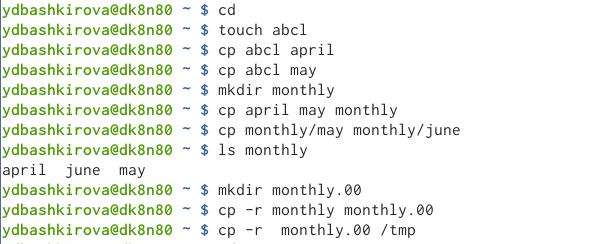{ #fig:001 width=70% }

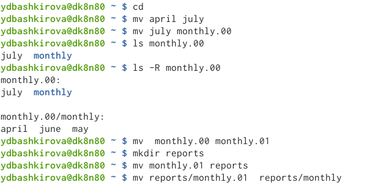{ #fig:001 width=70% }

{ #fig:001 width=70% }

2. Выполнила следующие действия, зафиксировав в отчёте по лабораторной работеиспользуемые при этом команды и результаты их выполнения:

Скопировала файл/usr/include/sys/io.h в домашний каталог и назовите его equipment. 

{ #fig:001 width=70% }

В домашнем каталоге создала директорию ~/ski.plases.

{ #fig:001 width=70% }

Переместила файл equipment в каталог ~/ski.plases

{ #fig:001 width=70% }

Переименовали файл ~/ski.plases/equipment в ~/ski.plases/equiplist.

{ #fig:001 width=70% }

Создала в домашнем каталоге файл abc1 и скопировала его в каталог ~/ski.plases, назвала его equiplist2.

{ #fig:001 width=70% }

Создала каталог с именемe quipment в каталоге ~/ski.plases

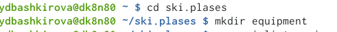{ #fig:001 width=70% }

Переместила файлы ~/ski.plases/equiplist и equiplist2 в каталог ~/ski.plases/equipment.

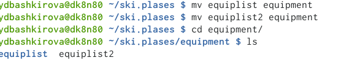{ #fig:001 width=70% }

Создала и переместила каталог ~/newdir в каталог ~/ski.plases и назовила его plans.

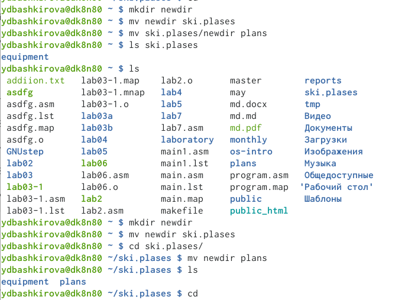{ #fig:001 width=70% }

3. Определила опции команды chmod, необходимые для того, чтобы присвоить перечисленным ниже файлам выделенные права доступа, считая, что в начале та-ких прав нет:

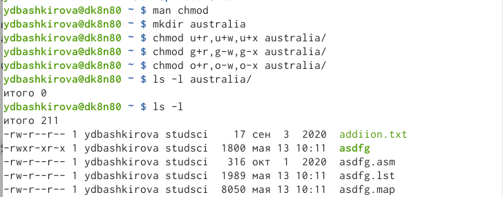{ #fig:001 width=70% }

{ #fig:001 width=70% }

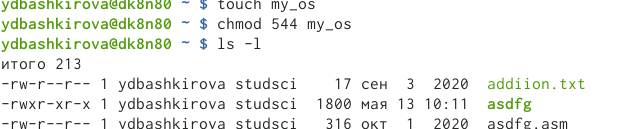{ #fig:001 width=70% }

{ #fig:001 width=70% }

4. Проделала приведённые ниже упражнения, записывая в отчёт по лабораторнойработе используемые при этом команды:

Просмотрела содержимое файла /etc/password.

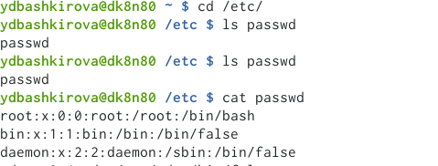{ #fig:001 width=70% }

Скопировала файл ~/feathers в файл~/file.old.

{ #fig:001 width=70% }

Переместила файл ~/file.oldв каталог~/play.

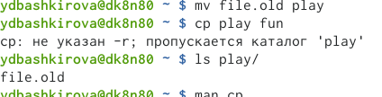{ #fig:001 width=70% }

Скопировала каталог ~/play в каталог ~/fun

{ #fig:001 width=70% }

Переместила каталог ~/fun в каталог ~/play и назовите его games.

{ #fig:001 width=70% }

Лишила владельца файла ~/feathers права на чтение.

{ #fig:001 width=70% }

Попытаетесь просмотреть файл ~/feathers командой cat

Попыталась скопировать файл ~/feather

Дала владельцу файла feathers право на чтение.

{ #fig:001 width=70% }

Лешила владельца каталог ~/play право на выполнение

{ #fig:001 width=70% }

Перейти в каталог ~/play.

{ #fig:001 width=70% }

Дала владельцу каталога ~/play право на выполнение

{ #fig:001 width=70% }

5. Прочитала man по командам mount,fsck,mkfs,kill и кратко их охарактеризуйте, приведя примеры.

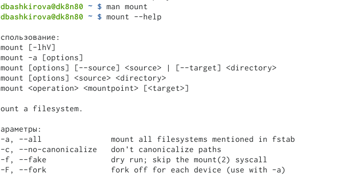{ #fig:001 width=70% }

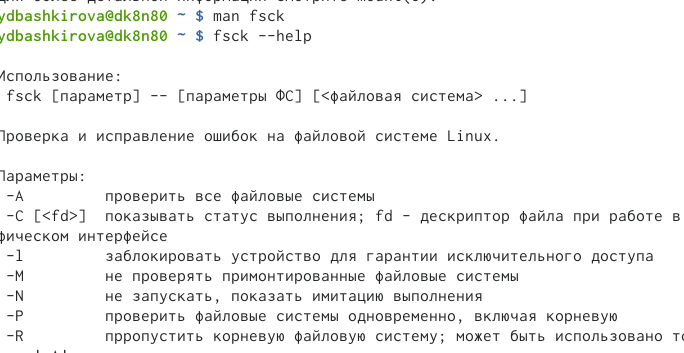{ #fig:001 width=70% }

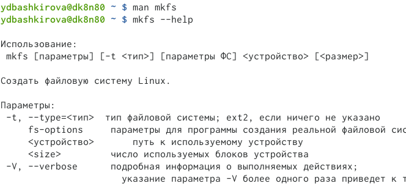{ #fig:001 width=70% }

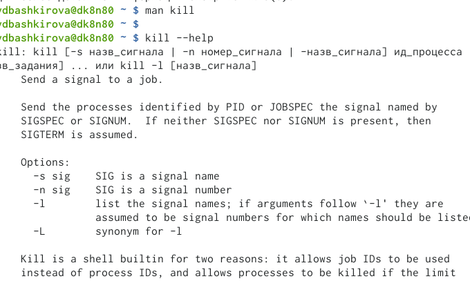{ #fig:001 width=70% }

# Выводы

Я ознакомилась с файловой системой Linux, её структурой, именами и содержанием каталогов. Приобрела практических навыков по применению команд для работы с файлами и каталогами, по управлению процессами (и работами), по проверке использования диска и обслуживанию файловой системы
