---
## Front matter
lang: ru-RU
title: Поиск файлов. Перенаправление ввода-вывода. Просмотр запущенных процессов.
author: Башкирова Я.Д
date: 14.05.2021

## Formatting
toc: false
slide_level: 2
theme: metropolis
header-includes: 
 - \metroset{progressbar=frametitle,sectionpage=progressbar,numbering=fraction}
 - '\makeatletter'
 - '\beamer@ignorenonframefalse'
 - '\makeatother'
aspectratio: 43
section-titles: true
---

# Отчет по лабораторной работе №7

## Цель работы 

Ознакомление с инструментами поиска файлов и фильтрации текстовых дан-ных. Приобретение практических навыков: по управлению процессами (и задания-ми), по проверке использования диска и обслуживанию файловых систем

## Запись названия файлов

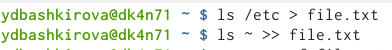{ #fig:001 width=70% }

## Имена всех файлов и новый текстовый файл

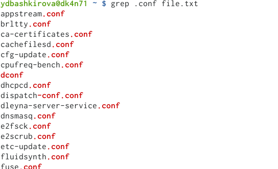{ #fig:001 width=70% }

{ #fig:001 width=70% }

## Имена файлов в домашнем каталоге

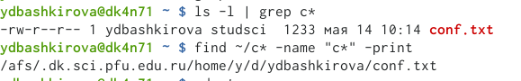{ #fig:001 width=70% }

## Имена файлов из каталога /etc

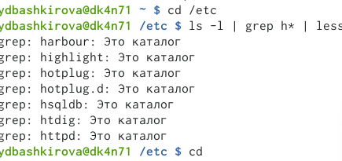{ #fig:001 width=70% }

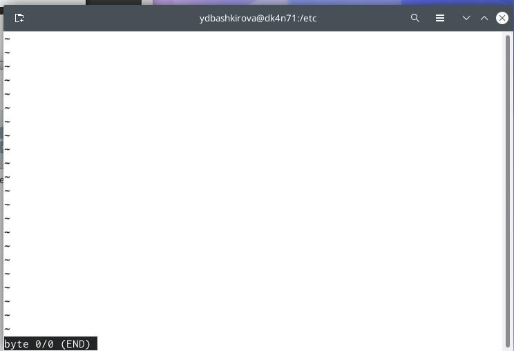{ #fig:001 width=70% }

## Удаление файла

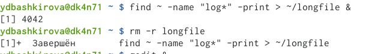{ #fig:001 width=70% }

## Запуск редактора

{ #fig:001 width=70% }

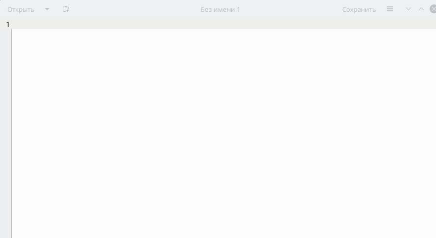{ #fig:001 width=70% }

## Индификатор процессора

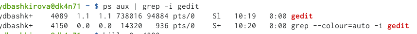{ #fig:001 width=70% }

## Команда ĸill

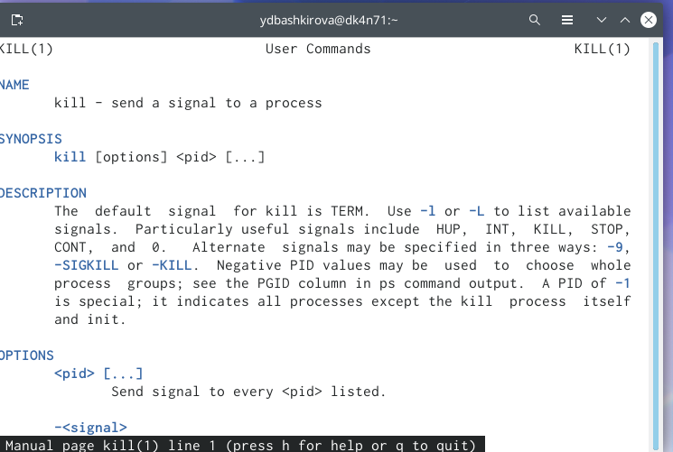{ #fig:001 width=70% }

{ #fig:001 width=70% }

## Команда man df

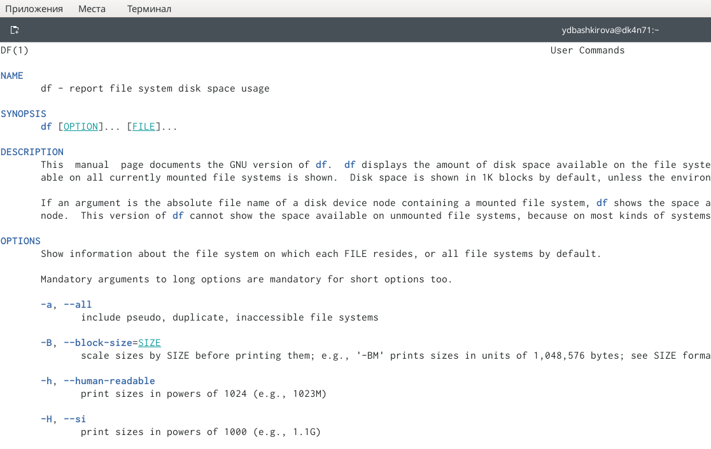{ #fig:001 width=70% }

## Команда man du

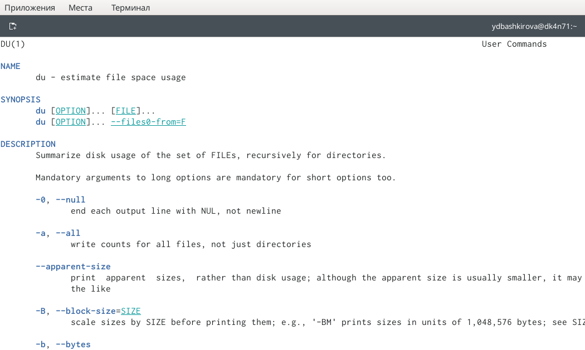{ #fig:001 width=70% }

## Команда df

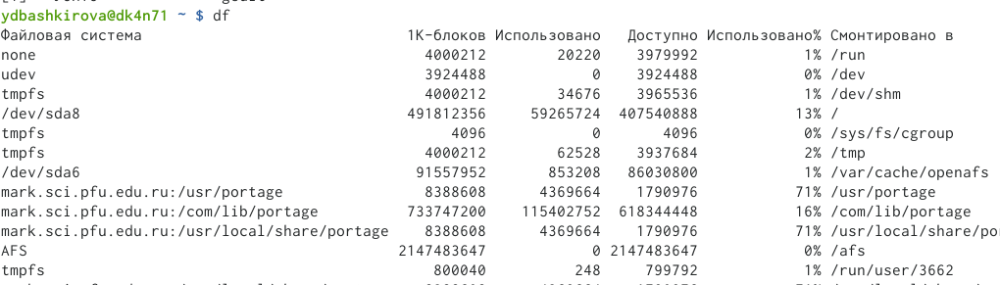{ #fig:001 width=70% }

## Команда du

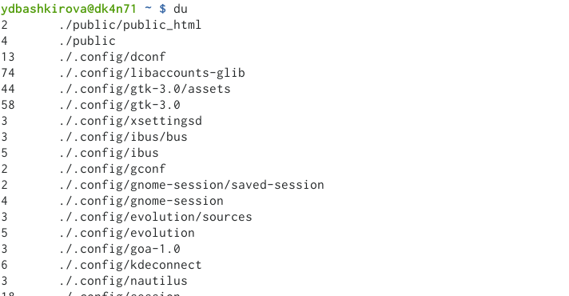{ #fig:001 width=70% }

## Справка команды find

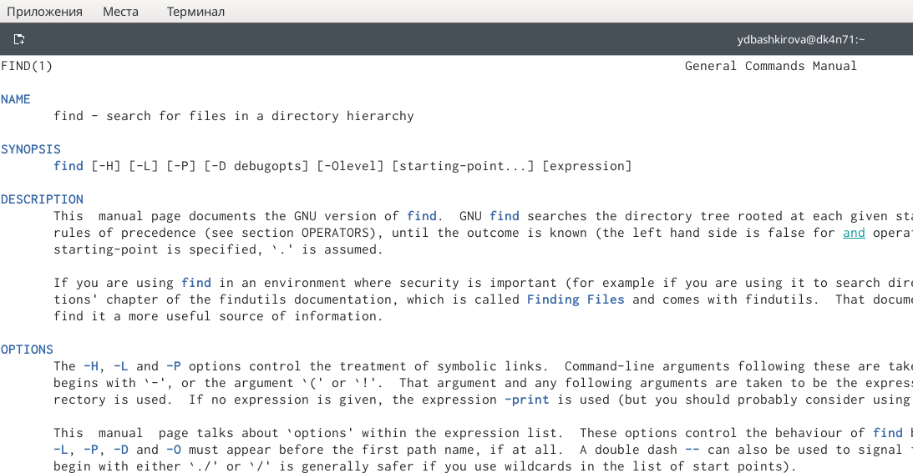{ #fig:001 width=70% }

## Имена всех директорий

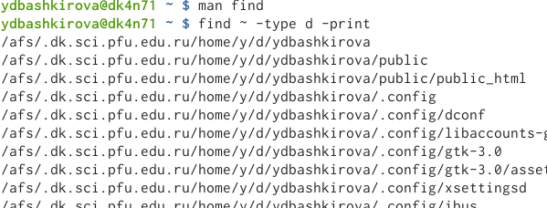{ #fig:001 width=70% }

## Вывод

Ознакомилась с инструментами поиска файлов и фильтрации текстовых данных. Приобрела практические навыки: по управлению процессами (и заданиями), по проверке использования диска и обслуживанию файловых систем.
