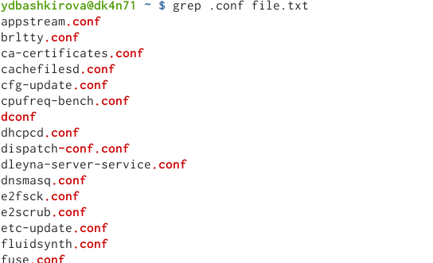
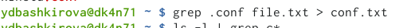
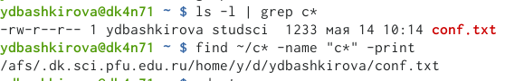
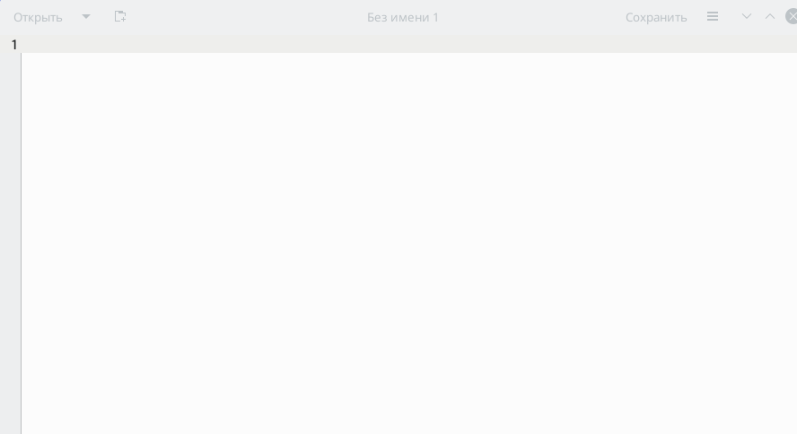
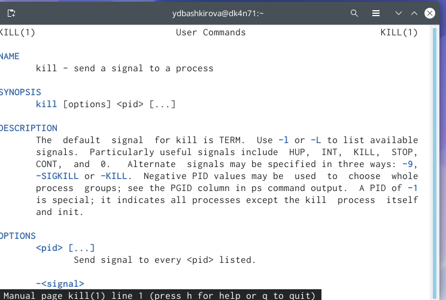
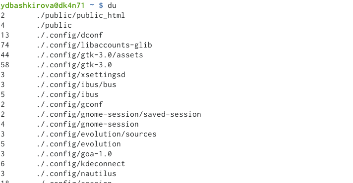
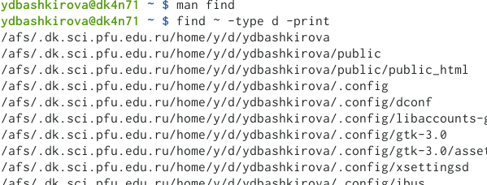

---
# Front matter
lang: ru-RU
title: "Поиск файлов. Перенаправлениеввода-вывода. Просмотр запущенных процессов"
subtitle: "Отчет по лабораторной работе 7"
author: "Башкирова Я.Д"

# Formatting
toc-title: "Содержание"
toc: true # Table of contents
toc_depth: 2
lof: true # List of figures
lot: true # List of tables
fontsize: 12pt
linestretch: 1.5
papersize: a4paper
documentclass: scrreprt
polyglossia-lang: russian
polyglossia-otherlangs: english
mainfont: PT Serif
romanfont: PT Serif
sansfont: PT Sans
monofont: PT Mono
mainfontoptions: Ligatures=TeX
romanfontoptions: Ligatures=TeX
sansfontoptions: Ligatures=TeX,Scale=MatchLowercase
monofontoptions: Scale=MatchLowercase
indent: true
pdf-engine: lualatex
header-includes:
  - \linepenalty=10 # the penalty added to the badness of each line within a paragraph (no associated penalty node) Increasing the value makes tex try to have fewer lines in the paragraph.
  - \interlinepenalty=0 # value of the penalty (node) added after each line of a paragraph.
  - \hyphenpenalty=50 # the penalty for line breaking at an automatically inserted hyphen
  - \exhyphenpenalty=50 # the penalty for line breaking at an explicit hyphen
  - \binoppenalty=700 # the penalty for breaking a line at a binary operator
  - \relpenalty=500 # the penalty for breaking a line at a relation
  - \clubpenalty=150 # extra penalty for breaking after first line of a paragraph
  - \widowpenalty=150 # extra penalty for breaking before last line of a paragraph
  - \displaywidowpenalty=50 # extra penalty for breaking before last line before a display math
  - \brokenpenalty=100 # extra penalty for page breaking after a hyphenated line
  - \predisplaypenalty=10000 # penalty for breaking before a display
  - \postdisplaypenalty=0 # penalty for breaking after a display
  - \floatingpenalty = 20000 # penalty for splitting an insertion (can only be split footnote in standard LaTeX)
  - \raggedbottom # or \flushbottom
  - \usepackage{float} # keep figures where there are in the text
  - \floatplacement{figure}{H} # keep figures where there are in the text
---

# Цель работы

Ознакомление с инструментами поиска файлов и фильтрации текстовых дан-ных. Приобретение практических навыков: по управлению процессами (и задания-ми), по проверке использования диска и обслуживанию файловых систем

# Задание

1. Осуществите вход в систему, используя соответствующее имя пользователя.
2. Запишите в файл file.txt названия файлов, содержащихся в каталоге/etc.Допишите в этот же файл названия файлов, содержащихся в вашем домашнем каталоге.
3. Выведите имена всех файлов из file.txt, имеющих расширение.conf, послечего запишите их в новый текстовой файл conf.txt.
4. Определите, какие файлы в вашем домашнем каталоге имеют имена, начинавшиеся с символа c? Предложите несколько вариантов, как это сделать.
5. Выведите на экран (по странично) имена файлов из каталога/etc, начинающиеся с символа h.
6. Запустите в фоновом режиме процесс, который будет записывать в файл ~/logfile файлы, имена которых начинаются с log.
7. Удалите файл ~/logfile.
8. Запустите из консолив фоновом режимередактор gedit.
9. Определите идентификатор процесса gedit, используя команду ps, конвейер и фильтр grep. Можно ли определить этот идентификатор более простым способом? 
10. Прочтите справку (man) команды kill, после чего используйте её для завершения процесса gedit.
11. Выполните команды df и du, предварительно получив более подробную информацию об этих командах, с помощью команды man.
12. Воспользовавшись справкой команды find, выведите имена всех директорий,имеющихся в вашем домашнем каталоге.

# Ход работы

1. Я осуществила вход в систему, используя соответствующее имя пользователя.
2. Я записала в файл file.txt названия файлов, содержащихся в каталоге /etc, и дописала в этот же файл названия файлов, содержащихся в домашнем каталоге.

{ #fig:001 width=70% }

3. Я вывела имена всех файлов из file.txt, имеющих расширение .conf, после чего записала их в новый текстовый файл conf.txt.

{ #fig:001 width=70% }

{ #fig:001 width=70% }

4. Я определила, какие файлы в домашнем каталоге имеют имена, начинавшиеся с символа c.

{ #fig:001 width=70% }

5. Я вывела на экран (по странично) имена файлов из каталога /etc, начинающиеся с символа h.

{ #fig:001 width=70% }

{ #fig:001 width=70% }

6. Я запустила в фоновом режиме процесс, который будет записывать в файл ~/logfile файлы, имена которых начинаются с log.
7. Я удалила файл ~/logfile.

{ #fig:001 width=70% }

8. Я запустила из консоли в фоновом режиме редактор gedit.

{ #fig:001 width=70% }

{ #fig:001 width=70% }

9. Я определила идентификатор процесса gedit, используя команду ps, конвейер и фильтр grep.

{ #fig:001 width=70% }

10. Я прочла справку (man) команды kill, после чего использовала её для завершения процесса gedit.

{ #fig:001 width=70% }

{ #fig:001 width=70% }

11. Я выполнила команды df и du, предварительно получив более подробную информацию об этих командах, с помощью команды man.

{ #fig:001 width=70% }

{ #fig:001 width=70% }

{ #fig:001 width=70% }

{ #fig:001 width=70% }

12. Я, воспользовавшись справкой команды find, вывела имена всех директорий, имеющихся в домашнем каталоге.

{ #fig:001 width=70% }

{ #fig:001 width=70% }

# Выводы

Ознакомилась с инструментами поиска файлов и фильтрации текстовых данных. Приобрела практические навыки: по управлению процессами (и заданиями), по проверке использования диска и обслуживанию файловых систем.

# Библиография

https://esystem.rudn.ru/pluginfile.php/1142505/mod_resource/content/2/004-lab_proc.pdf

# Контрольные вопросы 

1. В системе по умолчанию открыто три специальных потока:

– stdin — стандартный поток ввода (по умолчанию: клавиатура), файловый дескриптор 0;

– stdout — стандартный поток вывода (по умолчанию: консоль), файловый дескриптор 1;

– stderr — стандартный поток вывод сообщений об ошибках (по умолчанию: консоль), файловый дескриптор 2.

2. > - перенаправление stdout (вывода) в файл. Если файл отсутствовал, то он создаётся, иначе - перезаписывается.

>> - перенаправление stdout (вывода) в файл. Если файл отсутствовал, то он создаётся, иначе - добавляется.

3. Конвейер (pipe) служит для объединения простых команд или утилит в цепочки,

в которых результат работы предыдущей команды передаётся последующей.

4. Процесс это - совокупность программного кода и данных, загруженных в память ЭВМ. Любой команде, выполняемой в системе, присваивается идентификатор процесса (process ID). Получить информацию о процессе и управлять им, пользуясь

идентификатором процесса, можно из любого окна командного интерпретатора. Процессом называют выполняющуюся программу и все её элементы: адресное пространство, глобальные переменные, регистры, стек, открытые файлы и так далее.

5. PID — уникальный номер (идентификатор) процесса в многозадачной ОС.

GID – идентификатор группы.

6. Любую выполняющуюся в консоли команду или внешнюю программу можно запустить в фоновом режиме. Запущенные фоном программы называются задачами (jobs). Ими можно управлять с помощью команды jobs, которая выводит список запущенных в данный момент задач. Для завершения задачи необходимо выполнить команду kill %номер задачи.

7. Команда top в Linux системах позволяет вывести в виде таблицы перечень запущенных процессов и оценить, какой объем ресурсов они потребляют, т.е., какую нагрузку создают на сервер и дисковую подсистему.

Команда htop — продвинутый монитор процессов, показывает динамический список системных процессов, список обычно выравнивается по использованию ЦПУ. В отличие от top, htop показывает все процессы в системе. Также показывает время непрерывной работы, использование процессоров и памяти. htop часто применяется в тех случаях, когда информации даваемой утилитой top недостаточно, например при поиске утечек памяти в процессах.

8. Команда find используется для поиска и отображения имён файлов, соответствующих заданной строке символов. Формат команды: find путь [-опции]

Путь определяет каталог, начиная с которого по всем подкаталогам будет вестись

поиск. Примеры:

- вывести на экран имена файлов из вашего домашнего каталога и его подкаталогов, начинающихся на f: find ~ -name "f*" -print

- вывести на экран имена файлов в каталоге /etc, начинающихся с символа p:

find /etc -name "p*" -print

- найти в вашем домашнем каталоге файлы, имена которых заканчиваются символом и удалить их: find ~ -name "*~" -exec rm "{}" \;

9. Найти файл по контексту (содержанию) позволяет команда grep. 

Формат команды: grep строка имя_файла

Примеры:

- показать строки во всех файлах в вашем домашнем каталоге с именами, начинающимися на f, в которых есть слово begin: grep begin f*

- найти в текущем каталоге все файлы, в имени которых есть буквосочетание «лаб»: 

ls -l | grep лаб

10. Определить объем свободной памяти на жёстком диске позволяет команда df.

11. Определить объем домашнего каталога позволяет команда df /home/<user_name>

12. Удалить зависший процесс можно командой kill %номер задачи.
