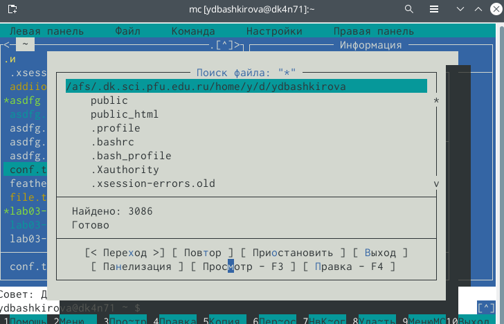
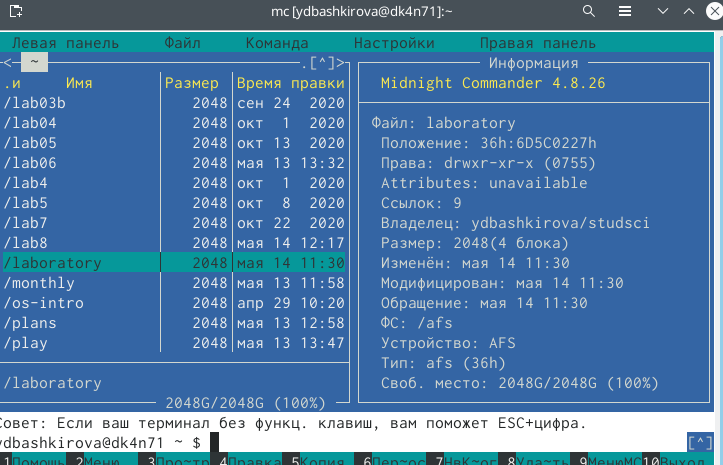

---
## Front matter
lang: ru-RU
title: Командная оболочка Midnight Commander
author: Башкирова Я.Д
date: 14.05.2021

## Formatting
toc: false
slide_level: 2
theme: metropolis
header-includes: 
 - \metroset{progressbar=frametitle,sectionpage=progressbar,numbering=fraction}
 - '\makeatletter'
 - '\beamer@ignorenonframefalse'
 - '\makeatother'
aspectratio: 43
section-titles: true
---

# Отчет по лабораторной работе №8

## Цель работы 

Освоение основных возможностей командной оболочки Midnight Commander.Приобретение навыков практической работы по просмотру каталогов и файлов; манипуляций с ними.

# Ход работы 

# Задание по mc

## Информация о mc

{ #fig:001 width=70% }

## Редактор mc

{ #fig:001 width=70% }

## Операции с панелями

{ #fig:001 width=70% }

## Копирование

{ #fig:001 width=70% }

## Перемещение

{ #fig:001 width=70% }

## Левая панель

{ #fig:001 width=70% }

## Правая панель

{ #fig:001 width=70% }

## Настройки

{ #fig:001 width=70% }

## Информация

{ #fig:001 width=70% }

## Содержимое текстового файла

{ #fig:001 width=70% }

## Редактирование содержимого текстового файла

{ #fig:001 width=70% }

## Создание каталога

{ #fig:001 width=70% }

## Копирование файлов 

{ #fig:001 width=70% }

## Поиск файла 

{ #fig:001 width=70% }

## Поиск файла

{ #fig:001 width=70% }

## Повторение одной из команд

{ #fig:001 width=70% }

## Переход в домашний каталог

{ #fig:001 width=70% }

## Файл меню

{ #fig:001 width=70% }

## Файл расширения

{ #fig:001 width=70% }

## Подменю

{ #fig:001 width=70% }

# Задание по встроенному редактору mc

## Текстовое меню

{ #fig:001 width=70% }

## Текстовый файл

{ #fig:001 width=70% }

## Вставка текст

{ #fig:001 width=70% }

## Удаление строки

{ #fig:001 width=70% }

## Копирование строки

{ #fig:001 width=70% }

## Перенос фрагмента текста

{ #fig:001 width=70% }

## Сохранение файла

{ #fig:001 width=70% }

## Отмена действия

{ #fig:001 width=70% }

## Новый текст в конце файла

{ #fig:001 width=70% }

## Новый текст в начале файла

{ #fig:001 width=70% }

## Файл с исходным тексом

{ #fig:001 width=70% }

## Выключение подсветки]

{ #fig:001 width=70% }

## Вывод 

Освоила основных возможностей командной оболочки Midnight Commander.Приобрела навыков практической работы по просмотру каталогов и файлов; манипуляций с ними. Редактор mc
