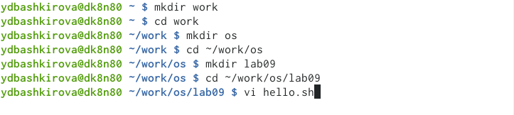
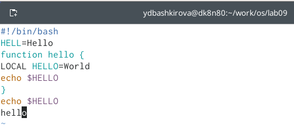
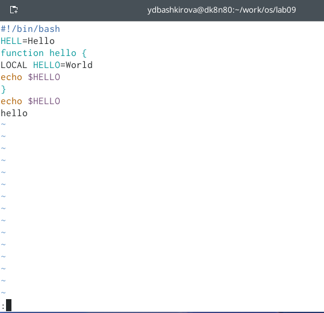
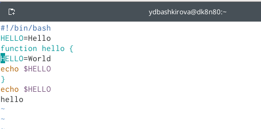

---
## Front matter
lang: ru-RU
title: Текстовой редакторvi
author: Башкирова Я.Д.
date: 20.05.2021

## Formatting
toc: false
slide_level: 2
theme: metropolis
header-includes: 
 - \metroset{progressbar=frametitle,sectionpage=progressbar,numbering=fraction}
 - '\makeatletter'
 - '\beamer@ignorenonframefalse'
 - '\makeatother'
aspectratio: 43
section-titles: true
---

# Отчет по лабораторной работе №9

## Цель работы

Познакомиться с операционной системой Linux. Получить практические навыки работы с редактором vi, установленным по умолчанию практически во всех дистрибутивах.

# Ход работы

# Создание нового файла с использованием vi

## Создание каталога

{ #fig:001 width=70% }

## Текст

{ #fig:001 width=70% }

## Приглашение в виде двоеточия

 { #fig:001 width=70% }

## Сохранение текста и завершение работы

{ #fig:001 width=70% }
 
## Исполняемый файл

!](image/05.png){ #fig:001 width=70% }

# Редактирование существующего файла

# Команда vi

{ #fig:001 width=70% }
 
## Установка курсора

{ #fig:001 width=70% }

## Режим вставки

{ #fig:001 width=70% }

## Установка курсора

{ #fig:001 width=70% }

## Режим вставки

{ #fig:001 width=70% } 

## Установка курсора

{ #fig:001 width=70% } 

## Удаление строки

{ #fig:001 width=70% } 

## Команда отмены изменений

{ #fig:001 width=70% } 

## Режим последний строки

{ #fig:001 width=70% } 

## Вывод 

Познакомилась с операционной системой Linux. Получила практические навыки работы с редактором vi, установленным по умолчанию практически во всех дистрибутивах.

