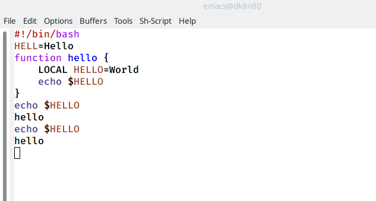

---
## Front matter
lang: ru-RU
title: Текстовой редакторemacs
author: Башкирова Я.Д.

## Formatting
toc: false
slide_level: 2
theme: metropolis
header-includes: 
 - \metroset{progressbar=frametitle,sectionpage=progressbar,numbering=fraction}
 - '\makeatletter'
 - '\beamer@ignorenonframefalse'
 - '\makeatother'
aspectratio: 43
section-titles: true
---

# Отчет по лабораторной работе №10

## Цель 

Познакомиться с операционной системой Linux. Получить практические навыки работы с редактором Emacs.

## Emacs

{ #fig:001 width=70% }

## Создание файла

{ #fig:001 width=70% }

## Текст

{ #fig:001 width=70% }

## Сохранение файла
 
{ #fig:001 width=70% }
 
## Вырезка

{ #fig:001 width=70% }
 
## Вставка строки

{ #fig:001 width=70% }

## Выделение области текста

{ #fig:001 width=70% }

## Вставка текста в конец файла

{ #fig:001 width=70% }

## Выделила область текста

{ #fig:001 width=70% }

## Вырезала область текста

{ #fig:001 width=70% }

## Отмена последнего действия

{ #fig:001 width=70% }

## Перемещение курсора в начало строки

{ #fig:001 width=70% }

## Перемещение курсора в конец строки

{ #fig:001 width=70% }

## Перемещение курсора в начало буфера

{ #fig:001 width=70% }

## Перемещение курсора в начало буфера

{ #fig:001 width=70% }
 
## Список активных буферов

{ #fig:001 width=70% }

## Другой буфер

{ #fig:001 width=70% }

## Закрытие окна

{ #fig:001 width=70% }

## Переключение между буферами
 
{ #fig:001 width=70% }

## 4 части фрейма

{ #fig:001 width=70% }

## Новый текст

{ #fig:001 width=70% }
 
## Режим поиска

{ #fig:001 width=70% }

## Результаты поиска

{ #fig:001 width=70% }

##Выход из режима поиска

{ #fig:001 width=70% }

## Режим поиска и замены

{ #fig:001 width=70% }

##Режим поиска

{ #fig:001 width=70% }

## Другой режим поиска

{ #fig:001 width=70% }

## Вывод

Познакомилась с операционной системой Linux. Получила практические навыки работы с редактором Emacs.

