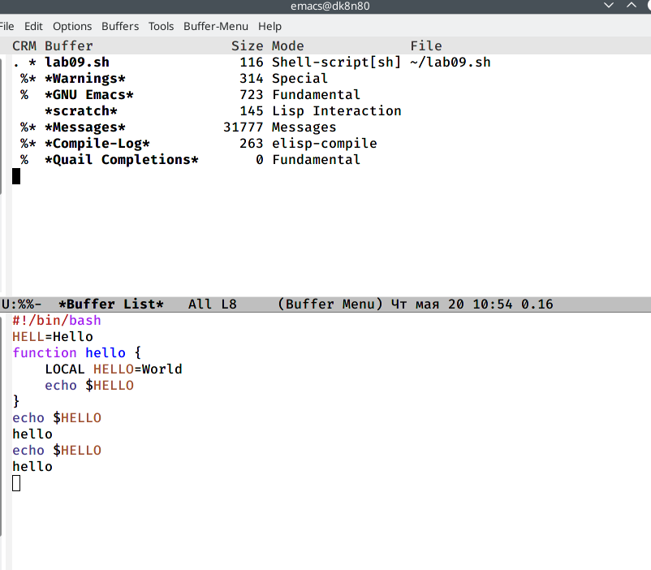

---
# Front matter
lang: ru-RU
title: "Текстовой редакторemacs"
subtitle: "Отчет по лабораторной работе №10"
author: "Башкирова Я.Д."

# Formatting
toc-title: "Содержание"
toc: true # Table of contents
toc_depth: 2
lof: true # List of figures
lot: true # List of tables
fontsize: 12pt
linestretch: 1.5
papersize: a4paper
documentclass: scrreprt
polyglossia-lang: russian
polyglossia-otherlangs: english
mainfont: PT Serif
romanfont: PT Serif
sansfont: PT Sans
monofont: PT Mono
mainfontoptions: Ligatures=TeX
romanfontoptions: Ligatures=TeX
sansfontoptions: Ligatures=TeX,Scale=MatchLowercase
monofontoptions: Scale=MatchLowercase
indent: true
pdf-engine: lualatex
header-includes:
  - \linepenalty=10 # the penalty added to the badness of each line within a paragraph (no associated penalty node) Increasing the value makes tex try to have fewer lines in the paragraph.
  - \interlinepenalty=0 # value of the penalty (node) added after each line of a paragraph.
  - \hyphenpenalty=50 # the penalty for line breaking at an automatically inserted hyphen
  - \exhyphenpenalty=50 # the penalty for line breaking at an explicit hyphen
  - \binoppenalty=700 # the penalty for breaking a line at a binary operator
  - \relpenalty=500 # the penalty for breaking a line at a relation
  - \clubpenalty=150 # extra penalty for breaking after first line of a paragraph
  - \widowpenalty=150 # extra penalty for breaking before last line of a paragraph
  - \displaywidowpenalty=50 # extra penalty for breaking before last line before a display math
  - \brokenpenalty=100 # extra penalty for page breaking after a hyphenated line
  - \predisplaypenalty=10000 # penalty for breaking before a display
  - \postdisplaypenalty=0 # penalty for breaking after a display
  - \floatingpenalty = 20000 # penalty for splitting an insertion (can only be split footnote in standard LaTeX)
  - \raggedbottom # or \flushbottom
  - \usepackage{float} # keep figures where there are in the text
  - \floatplacement{figure}{H} # keep figures where there are in the text
---

# Цель работы

Познакомиться с операционной системой Linux. Получить практические навыки работы с редактором Emacs.

# Задание

1. Открыть emacs.
2. Создать файл lab07.sh с помощью комбинации Ctrl-xCtrl-f(C-x C-f).
3. Наберите текст:
```bash
#!/bin/bash
HELL=Hello
function
hello{
LOCAL HELLO=World
echo $HELLO
}
echo $HELLO
hello
```
4. Сохранить файл с помощью комбинации Ctrl-xCtrl-s(C-x C-s).
5. Проделать с текстом стандартные процедуры редактирования, каждое действие должно осуществляться комбинацией клавиш.
5.1.Вырезать одной командой целую строку (С-k).
5.2.Вставить эту строку в конец файла (C-y).
5.3.Выделить область текста (C-space).
5.4.Скопировать область в буфер обмена (M-w).
5.5.Вставить область в конец файла.
5.6.Вновь выделить эту область и на этот раз вырезать её (C-w).
5.7.Отмените последнее действие (C-/).
6. Научитесь использовать команды по перемещению курсора.
6.1.Переместите курсор в начало строки (C-a).
6.2.Переместите курсор в конец строки (C-e).
6.3.Переместите курсор в начало буфера (M-<).
6.4.Переместите курсор в конец буфера (M->).
7. Управление буферами.
7.1.Вывести список активных буферов на экран (C-x C-b)
7.2.Переместитесь во вновь открытое окно (C-x) o со списком открытых буферов и переключитесь на другой буфер.
7.3.Закройте это окно (C-x 0).
7.4.Теперь вновь переключайтесь между буферами, но уже без вывода их спискана экран (C-x b).
8. Управление окнами.
8.1.Поделите фрейм на 4 части: разделите фрейм на два окна по вертикали(C-x 3), а затем каждое из этих окон на две части по горизонтали (C-x 2)(см. рис.7.1)
8.2.В каждом из четырёх созданных окон откройте новый буфер (файл) и введите несколько строк текста.
9. Режим поиска
9.1.Переключитесь в режим поиска(C-s)инайдитенесколькослов,присутствующих в тексте.9.2.Переключайтесь между результатами поиска, нажимая C-s.
9.3.Выйдите из режима поиска, нажав C-g.
9.4.Перейдите в режим поиска и замены (M-%), введите текст, который следует найти и заменить, нажмите Enter, затем введите текст для замены. После того как будут подсвечены результаты поиска, нажмите ! для подтверждениязамены.
9.5.Испробуйте другой режим поиска, нажав M-s o. Объясните, чем он отличается от обычного режима?

# Ход работы

1. Я открыла emacs.

{ #fig:001 width=70% }

2. Я создала файл lab07.sh с помощью комбинации Ctrl-x Ctrl-f (C-x C-f).
 
{ #fig:001 width=70% }

3. Я набрала текст:
```bash
#!/bin/bash
HELL=Hello
function hello {
     LOCAL HELLO=World
     echo $HELLO
}
echo $HELLO
hello
```

{ #fig:001 width=70% }

4. Я сохранила файл с помощью комбинации Ctrl-x Ctrl-s (C-x C-s).
 
{ #fig:001 width=70% }
 
5. Я проделала с текстом стандартные процедуры редактирования, каждое действие должно осуществляться комбинацией клавиш.
5.1. Я вырезала одной командой целую строку (С-k).

{ #fig:001 width=70% }
 
5.2. Я вставила эту строку в конец файла (C-y).

{ #fig:001 width=70% }
 
5.3. Я выделила область текста (C-space).

{ #fig:001 width=70% }

5.4. Я скопировала область в буфер обмена (M-w).
5.5. Я вставила область в конец файла.

{ #fig:001 width=70% }

5.6. Я вновь выделила эту область и на этот раз вырезала её (C-w).

{ #fig:001 width=70% }

{ #fig:001 width=70% }

5.7. Я отменила последнее действие (C-/).

{ #fig:001 width=70% }
 
6. Я научилась использовать команды по перемещению курсора.
6.1. Я переместила курсор в начало строки (C-a).

{ #fig:001 width=70% }

6.2. Я переместила курсор в конец строки (C-e).

{ #fig:001 width=70% }

6.3. Я переместила курсор в начало буфера (M-<).

{ #fig:001 width=70% }

6.4. Я переместила курсор в конец буфера (M->).

{ #fig:001 width=70% }
 
7. Управление буферами.
7.1. Я вывела список активных буферов на экран (C-x C-b).

{ #fig:001 width=70% }

7.2. Я переместилась во вновь открытое окно (C-x) со списком открытых буфе-ров и переключилась на другой буфер.

{ #fig:001 width=70% }

7.3. Я закрыла это окно (C-x 0).

{ #fig:001 width=70% }

7.4. Теперь вновь переключайтесь между буферами, но уже без вывода их списка на экран (C-x b).
 
{ #fig:001 width=70% }

8. Управление окнами.
8.1. Я поделила фрейм на 4 части: разделила фрейм на два окна по вертикали (C-x 3), а затем каждое из этих окон на две части по горизонтали (C-x 2).

{ #fig:001 width=70% }

8.2. В каждом из четырёх созданных окон я открыла новый буфер (файл) и ввела несколько строк текста.

{ #fig:001 width=70% }
 
9. Режим поиска
9.1. Я переключилась в режим поиска (C-s) и нашла несколько слов, присутствующих в тексте.

{ #fig:001 width=70% }

9.2. Я переключалась между результатами поиска, нажимая C-s.

{ #fig:001 width=70% }


9.3. Я вышла из режима поиска, нажав C-g.

{ #fig:001 width=70% }

9.4. Я перешла в режим поиска и замены (M-%), ввела текст, который следует
найти и заменить, нажала Enter, затем ввела текст для замены. После того как подсветились результаты поиска, я нажала ! для подтверждения замены.

{ #fig:001 width=70% }


9.5. Я испробовала другой режим поиска, нажав M-so.

{ #fig:001 width=70% }

# Выводы

Познакомилась с операционной системой Linux. Получила практические навыки работы с редактором Emacs.

# Библиография

https://esystem.rudn.ru/pluginfile.php/1142514/mod_resource/content/3/007-lab_emacs.pdf

# Контрольные вопросы 

1. Emacs представляет собой мощный экранный редактор текста, написанный на

языке высокого уровня Elisp.

2. Развитие Emacs в сторону его многогранности послужило причиной того, что и без того интуитивно непонятная программа стала чрезвычайно сложной в применении. В частности, управление осуществляется при помощи различных клавиатурных комбинаций, запомнить которые будет непросто.

3. Буфер – что-то, состоящее из текста. 

Окно – область с одним из буферов.

4. В одном окне можно открыть больше 10 буферов.

5. После запуска emacs без каких-либо параметров в основном окне отображается буфер *scratch*, который используется для оценки выражений Emacs Lisp, а также для заметок, которые вы не хотите сохранять. Этот буфер не сохраняется автоматически.

6. Чтобы ввести следующую комбинацию C-c | я нажмуклавиши: Control+c и Shift+\, и для C-c C-|: Control+c и Control+Shift+\.

7. Поделить текущее окно на две части можно двумя комбинациями клавиш: 

C-x 3 или C-x 2.

8. Настроить или расширить Emacs можно написав или изменив файл ~/.emacs.

9. Клавиша ß выполняет функцию перемещения курсора в открытом окне также, как и многие другие клавиши её можно переназначить.

10. Редактор emacs показался мне удобнее из-за возможности открытия нескольких окон с буферами и работать комбинациями клавиш в этот редакторе мне было проще.

