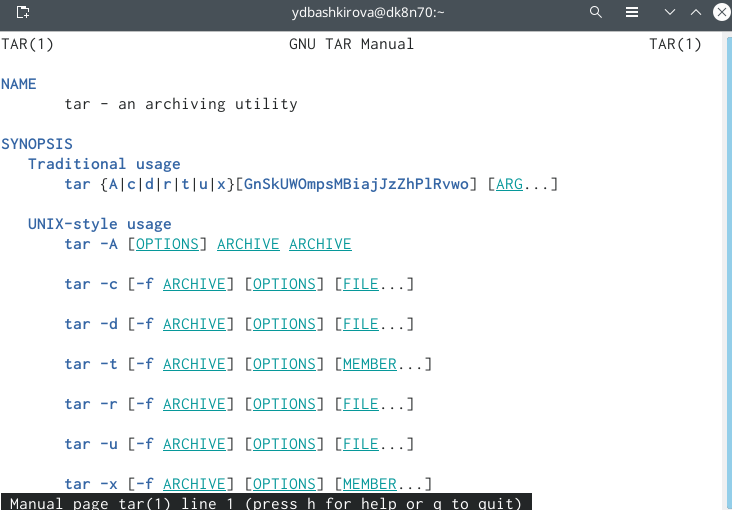
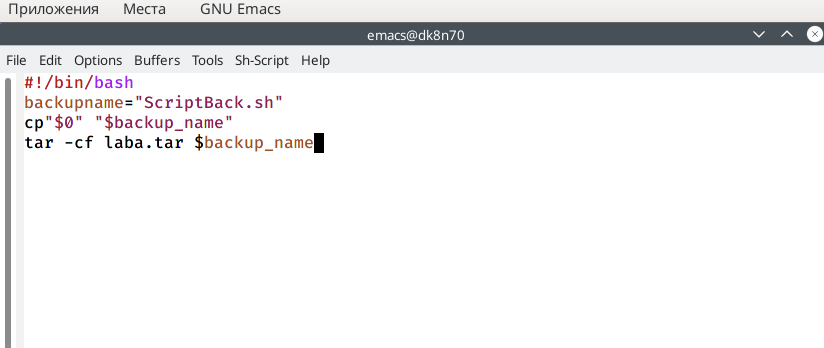
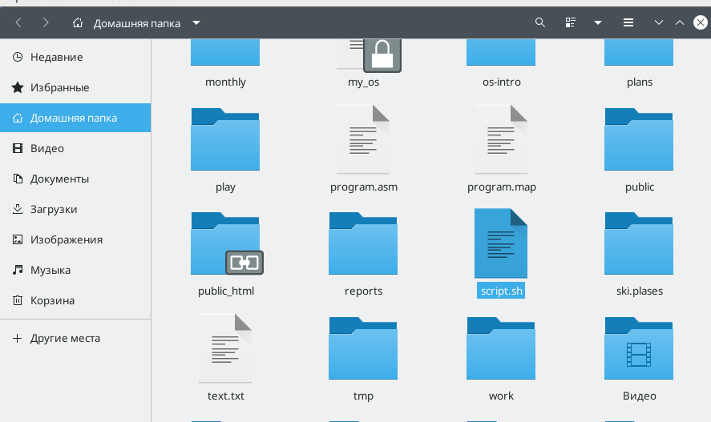
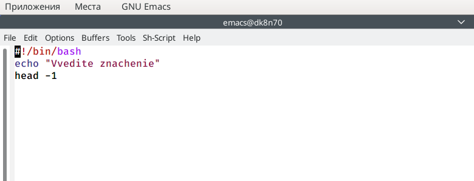
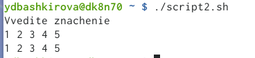
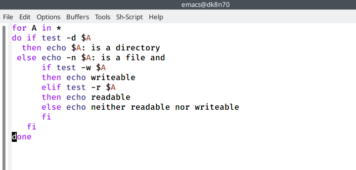
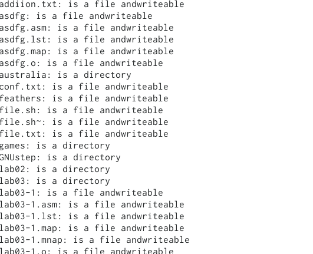
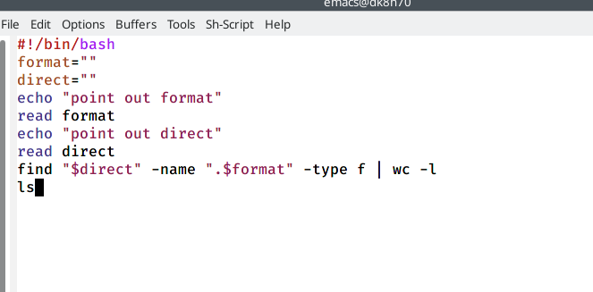
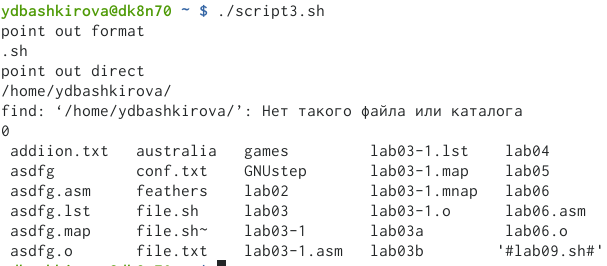

---
## Front matter
lang: ru-RU
title:  Программирование в командномпроцессоре ОС UNIX. Командные файлы
author: Башкирова Я.Д
date: 26.05.2021

## Formatting
toc: false
slide_level: 2
theme: metropolis
header-includes: 
 - \metroset{progressbar=frametitle,sectionpage=progressbar,numbering=fraction}
 - '\makeatletter'
 - '\beamer@ignorenonframefalse'
 - '\makeatother'
aspectratio: 43
section-titles: true
---

# Отчет по лабораторной работе №11

## Цель работы

Изучить основы программирования в оболочке ОС UNIX/Linux. Научиться писать небольшие командные файлы.

# Ход работы

## Справка команды архивации

{ #fig:001 width=70% }

## Создание файла и дача ему прав

{ #fig:002 width=70% }

## Скрипт

{ #fig:003 width=70% }

## Скрипт в домашней папке

{ #fig:004 width=70% }

##  Скрипт 2

{ #fig:005 width=70% } 

## Вывод всех переданных аргументов

{ #fig:006 width=70% } 

## Командный файл

{ #fig:007 width=70% } 

## Информация
 
{ #fig:008 width=70% } 

## Скрипт 3

{ #fig:009 width=70% }

## Вычисление количества файлов

{ #fig:010 width=70% }

## Выводы

Изучила основы программирования в оболочке ОС UNIX/Linux. Научилась писать небольшие командные файлы.

