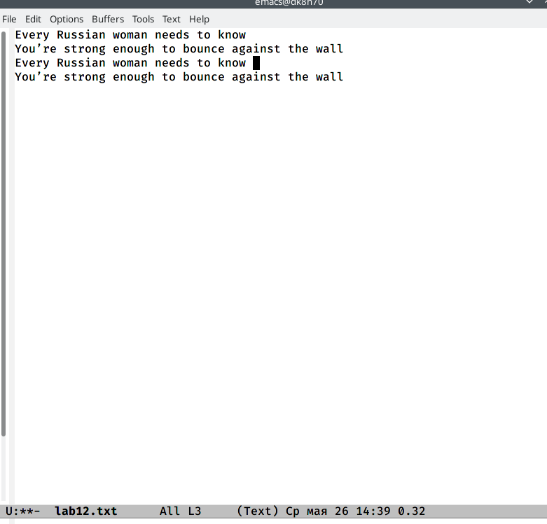
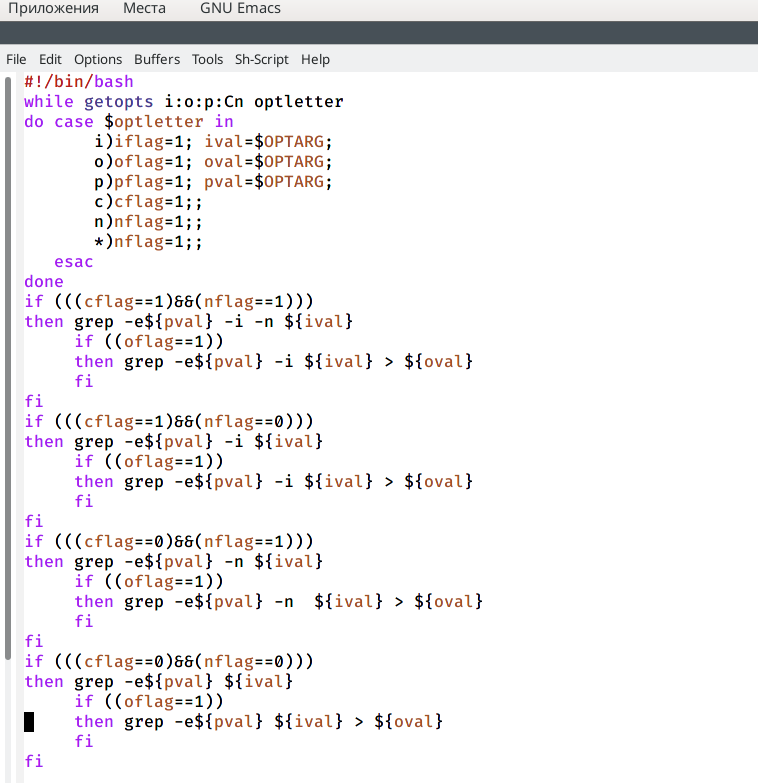
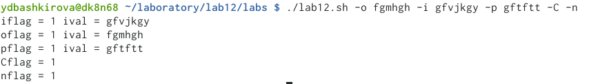
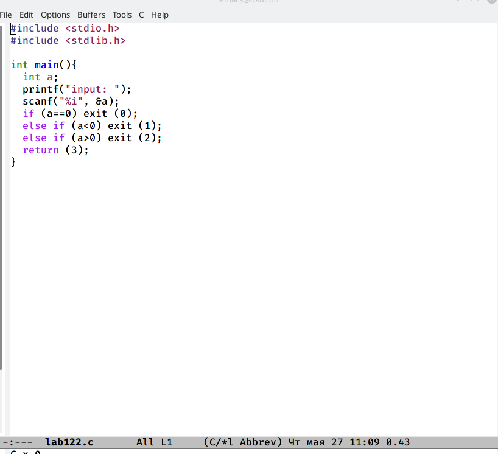
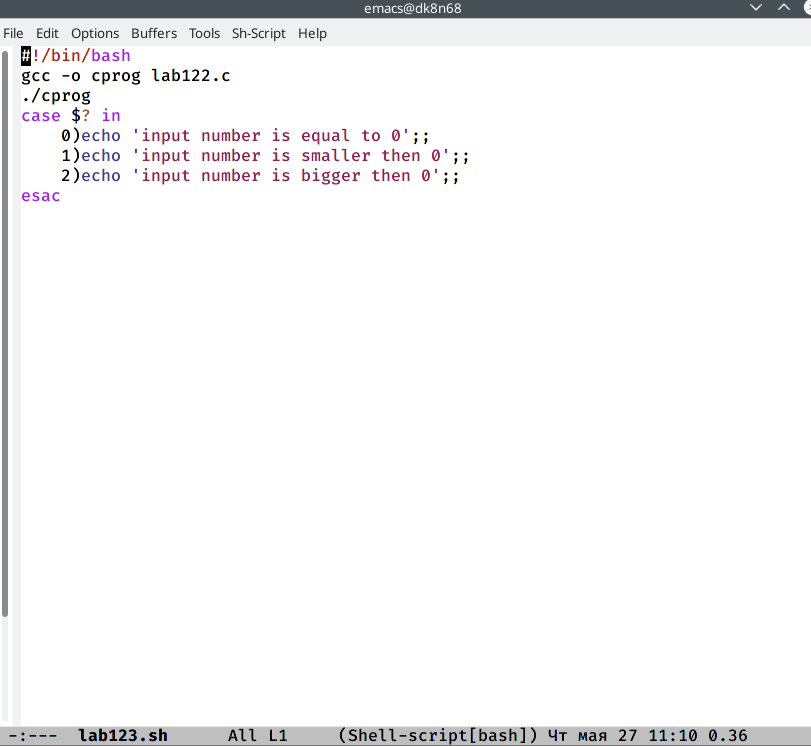
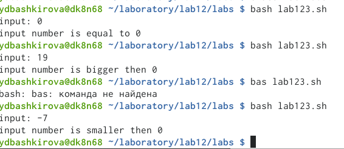
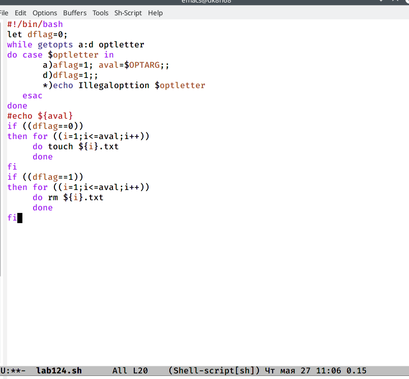
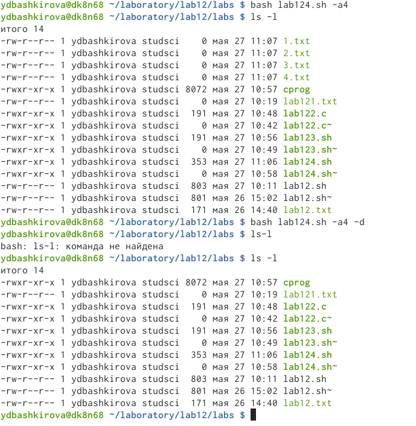
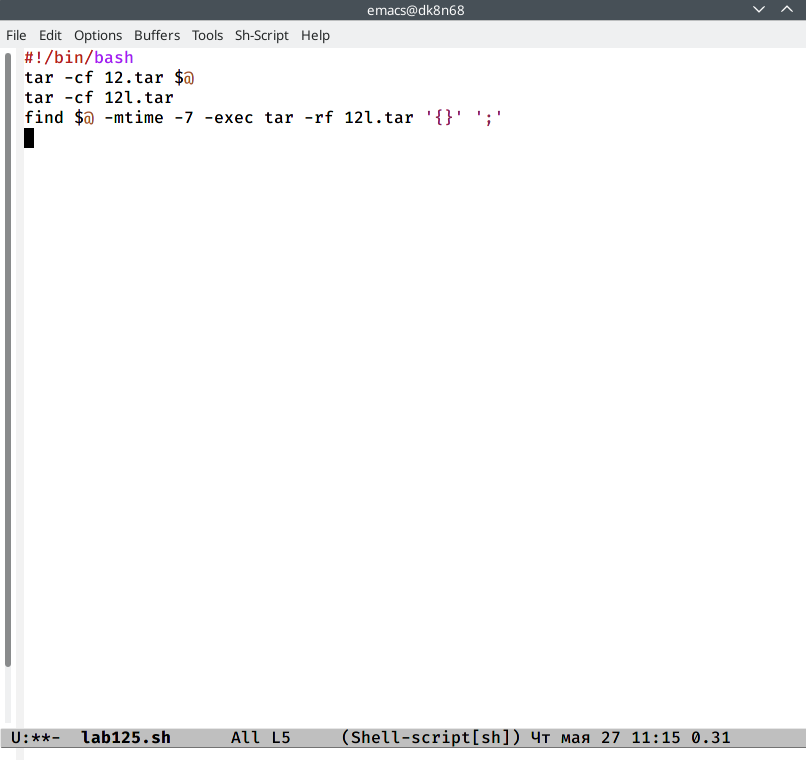
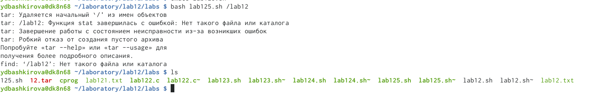

---
## Front matter
lang: ru-RU
title: Программирование в командномпроцессоре ОС UNIX. Ветвления и циклы
author: Башкирова Я.Д
date: 27.05.2021

## Formatting
toc: false
slide_level: 2
theme: metropolis
header-includes: 
 - \metroset{progressbar=frametitle,sectionpage=progressbar,numbering=fraction}
 - '\makeatletter'
 - '\beamer@ignorenonframefalse'
 - '\makeatother'
aspectratio: 43
section-titles: true
---

# Отчет по лабораторной работе №12

## Цель работы

Изучить основы программирования в оболочке ОС UNIX/Linux. Научиться писать небольшие командные файлы.

# Ход работы

## Текст

{ #fig:001 width=70% }

## Командный файл,который анализирует командную строку

{ #fig:001 width=70% }

## Анализ командной строки с ключами

{ #fig:001 width=70% }

## Программа на языке Си

{ #fig:001 width=70% }

## Командный файл

{ #fig:001 width=70% }

## Ввод чисел

{ #fig:001 width=70% }

## Командный файл,создающий указанное число файлов

{ #fig:001 width=70% }

## Число файлов от 1 до N и их удаление

{ #fig:001 width=70% }

## Командный файл,запаковывающий в архив все файлы

{ #fig:001 width=70% }

## Архив всех файлов в указанной директории

{ #fig:001 width=70% }

## Выводы

Изучила основы программирования в оболочке ОС UNIX/Linux. Научилась писать небольшие командные файлы.
